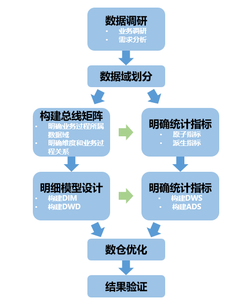
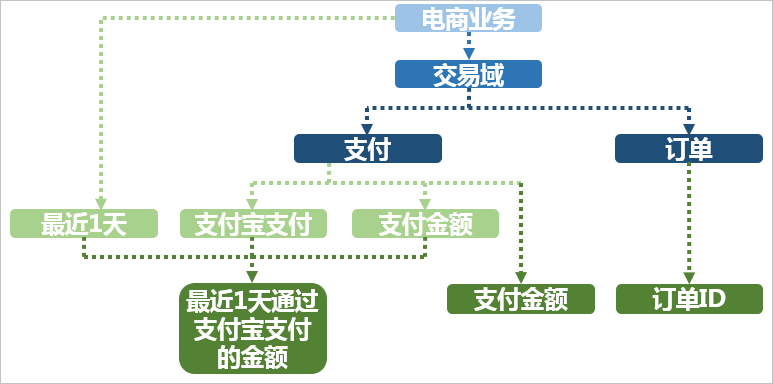
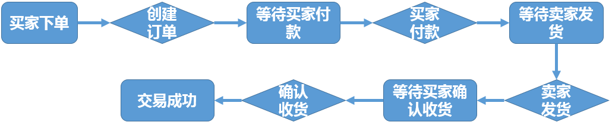
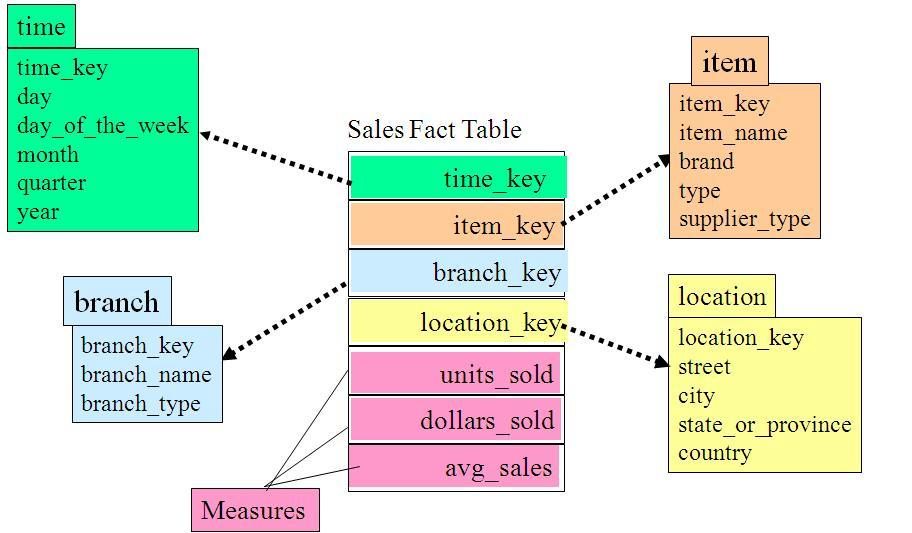
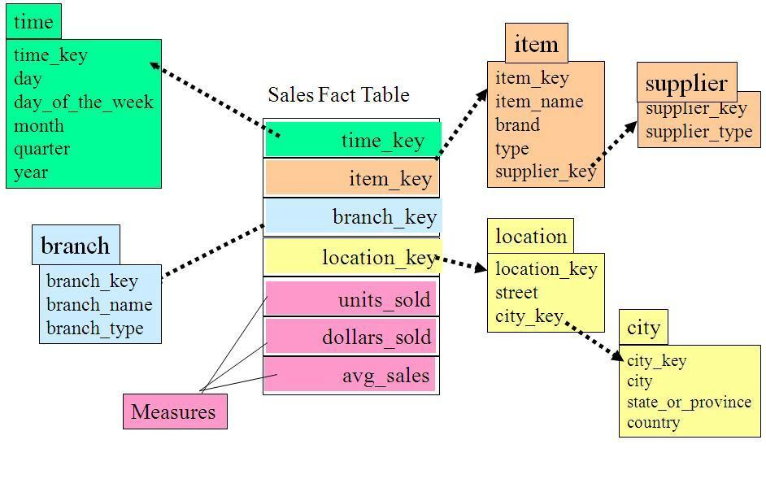
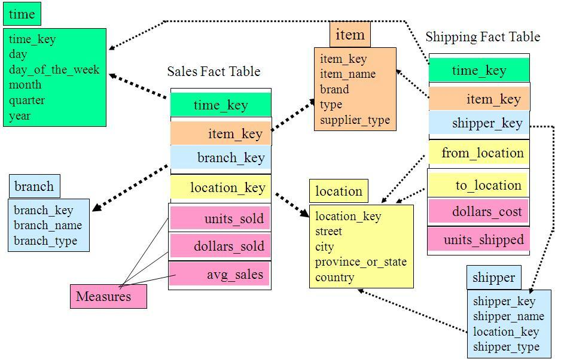

这里参考滴滴的实时数仓分层设计，其实分层设计思路是通用的，可以按照自己公司的业务基于实现

[实时数仓在滴滴的实践和落地](https://mp.weixin.qq.com/s/PdxjNQd7SNx1POv6fVKVmA)

---

## 分层设计思路

- ODS: **操作型数据**(Operational Data Store)，指结构与源系统基本保持一致的增量或者全量数据。作为DW数据的一个数据准备区，同时又承担基础数据记录历史变化，之所以保留原始数据和线上原始数据保持一致，方便后期数据核对需要。
- DWD：数据仓库**明细层数据**(Data Warehouse Detail)。对ODS层数据进行清洗转化，以**业务过程作为建模驱动**，基于每个具体的业务过程特点，构建**最细粒度的明细事实表**。可以结合企业的数据使用特点，基于**维度建模**思想，将明细事实表的某些重要属性字段做适当冗余，也即**宽表化处理**，构建明细宽表。
- DWS：数据仓库**汇总层数据**(Data Warehouse Summary)，基于指标需求，构建初步**汇总事实表**，一般是宽表。基于上层的应用和产品的指标需求，构建**公共粒度的汇总指标表**。以宽表化手段物理化模型，构建命名规范、口径一致的统计指标，**为上层提供公共指标**。
- DIM：建立**一致数据分析维表**，可以降低数据计算口径不统一的风险，同时可以方便进行交叉探查。以维度作为建模驱动，基于每个维度的业务含义，通过添加维度属性、关联维度等定义计算逻辑，完成属性定义的过程并建立一致的数据分析维表。
- ADS：面向应用的**数据服务层**(Application Data Service)。整合汇总成分析某一个主题域的服务数据，面向应用逻辑的数据加工。该层主要**存放数据产品个性化的统计指标数据**，这一层的数据直接对接数据的消费者，是产品、运营等角色可以直接感知理解的一层，大多数这一层的表都可以直接在BI上通过图表的形式直接透出。

## 数仓构建流程

Kimball老爷爷维度建模四部曲： 

**选择业务处理过程 > 定义粒度 > 选择维度 > 确定事实**

## 基本概念 

- 业务板块：比数据域更高维度的业务划分方法，适用于庞大的业务系统。
- 维度：维度建模由Ralph Kimball提出。维度模型主张从分析决策的需求出发构建模型，为分析需求服务。维度是度量的环境，是我们观察业务的角度，用来反映业务的一类属性。属性的集合构成维度，维度也可以称为实体对象。例如，在分析交易过程时，可以通过买家、卖家、商品和时间等维度描述交易发生的环境。
- 属性（维度属性）：维度所包含的表示维度的列称为维度属性。维度属性是查询约束条件、分组和报表标签生成的基本来源，是数据易用性的关键。
- 度量：在维度建模中，将度量称为事实，将环境描述为维度，维度是用于分析事实所需要的多样环境。度量通常为数值型数据，作为事实逻辑表的事实。
- 指标：指标分为原子指标和派生指标。原子指标是基于某一业务事件行为下的度量，是业务定义中不可再拆分的指标，是具有明确业务含义的名词，体现明确的业务统计口径和计算逻辑，例如支付金额。业务限定：统计的业务范围，筛选出符合业务规则的记录（类似于SQL中where后的条件，不包括时间区间）。
  - 原子指标=业务过程+度量。
  - 派生指标=时间周期+修饰词+原子指标，派生指标可以理解为对原子指标业务统计范围的圈定。
- 统计周期：统计的时间范围，例如最近一天，最近30天等（类似于SQL中where后的时间条件）。
- 统计粒度：统计分析的对象或视角，定义数据需要汇总的程度，可理解为聚合运算时的分组条件（类似于SQL中的group by的对象）。粒度是维度的一个组合，指明您的统计范围。例如，某个指标是某个卖家在某个省份的成交额，则粒度就是卖家、地区这两个维度的组合。如果您需要统计全表的数据，则粒度为全表。在指定粒度时，您需要充分考虑到业务和维度的关系。统计粒度常作为派生指标的修饰词而存在。

基本概念之间的关系和举例如下图所示。

### 业务过程

业务过程可以概括为一个个不可拆分的行为事件。用户的业务系统中，通过埋点或日常积累，通常已经获取了充足的业务数据。为理清数据之间的逻辑关系和流向，首先需要理解用户的业务过程，了解过程中涉及到的数据系统。

您可以采用过程分析法，将整个业务过程涉及的每个环节一一列清楚，包括技术、数据、系统环境等。在分析企业的工作职责范围（部门）后，您也可以借助工具通过逆向工程抽取业务系统的真实模型。您可以参考业务规划设计文档以及业务运行（开发、设计、变更等）相关文档，全面分析数据仓库涉及的源系统及业务管理系统：

- 每个业务会生成哪些数据，存在于什么数据库中。
- 对业务过程进行分解，了解过程中的每一个环节会产生哪些数据，数据的内容是什么。
- 数据在什么情况下会更新，更新的逻辑是什么。

业务过程可以是单个业务事件，例如交易的支付、退款等；也可以是某个事件的状态，例如当前的账户余额等；还可以是一系列相关业务事件组成的业务流程。具体取决于您分析的是某些事件过去发生情况、当前状态还是事件流转效率。

选择粒度：在业务过程事件分析中，您需要预判所有分析需要细分的程度和范围，从而决定选择的粒度。 识别维表、选择好粒度之后，您需要基于此粒度设计维表，包括维度属性等，用于分析时进行分组和筛选。最后，您需要确定衡量的指标。

本教程中，经过业务过程调研，我们了解到用户电商营销业务的交易订单功能模块的业务流程如下。

这是一个非常典型的电商交易业务流程图。在该业务流程图中，有创建订单、买家付款、卖家发货、确认收货四个核心业务步骤。由于确认收货代表交易成功，我们重点分析确认收货（交易成功）步骤即可。

在明确用户的业务过程之后，您可以根据需要对进行分析决策的业务划分数据域。

### 划分数据域

数据仓库是面向主题（数据综合、归类并进行分析利用）的应用。数据仓库模型设计除横向的分层外，通常也需要根据业务情况纵向划分数据域。数据域是联系较为紧密的数据主题的集合，是业务对象高度概括的概念，目的是便于管理和应用数据。

通常，您需要阅读各源系统的设计文档、数据字典和数据模型，研究逆向导出的物理数据模型。进而，可以进行跨源的主题域合并，跨源梳理出整个企业的数据域。

数据域是指面向业务分析，将业务过程或者维度进行抽象的集合。为保障整个体系的生命力，数据域需要抽象提炼，并长期维护更新。在划分数据域时，既能涵盖当前所有的业务需求，又能让新业务在进入时可以被包含进已有的数据域或扩展新的数据域。数据域的划分工作可以在业务调研之后进行，需要分析各个业务模块中有哪些业务活动。

数据域可以按照用户企业的部门划分，也可以按照业务过程或者业务板块中的功能模块进行划分。例如A公司电商营销业务板块可以划分为如下数据域，数据域中每一部分都是实际业务过程经过归纳抽象之后得出的。

| 数据域     | 业务过程                         |
| :--------- | :------------------------------- |
| 会员店铺域 | 注册、登录、装修、开店、关店     |
| 商品域     | 发布、上架、下架、重发           |
| 日志域     | 曝光、浏览、单击                 |
| 交易域     | 下单、支付、发货、确认收货       |
| 服务域     | 商品收藏、拜访、培训、优惠券领用 |
| 采购域     | 商品采购、供应链管理             |

### 定义维度与构建总线矩阵

#### 定义维度

在划分数据域、构建总线矩阵时，需要结合对业务过程的分析定义维度。以本教程中A电商公司的营销业务板块为例，在交易数据域中，我们重点考察确认收货（交易成功）的业务过程。

在确认收货的业务过程中，主要有商品和收货地点（本教程中，假设收货和购买是同一个地点）两个维度所依赖的业务角度。从商品维度我们可以定义出以下维度的属性：

- 商品ID（主键）
- 商品名称
- 商品交易价格
- 商品新旧程度： 1 全新 2 闲置 3 二手
- 商品类目ID
- 商品类目名称
- 品类ID
- 品类名称
- 买家ID
- 商品状态： 0 正常 1 删除 2 下架 3 从未上架
- 商品所在城市
- 商品所在省份

从地域维度，我们可以定义出以下维度的属性：

- 城市code
- 城市名称
- 省份code
- 省份名称

作为维度建模的核心，在企业级数据仓库中必须保证维度的唯一性。以A公司的商品维度为例，有且只允许有一种维度定义。例如，省份code这个维度，对于任何业务过程所传达的信息都是一致的。

#### 构建总线矩阵

明确每个数据域下有哪些业务过程后，即可构建总线矩阵。您需要明确业务过程与哪些维度相关，并定义每个数据域下的业务过程和维度。如下所示是A公司电商板块交易功能的总线矩阵，我们定义了购买省份、购买城市、类目名称、类目ID、品牌名称、品牌ID、商品名称、商品ID、成交金额等维度。

| 数据域/过程 | 一致性维度 |        |          |        |          |        |          |          |      |      |
| ----------- | ---------- | ------ | -------- | ------ | -------- | ------ | -------- | -------- | ---- | ---- |
| 购买省份    | 购买城市   | 类目ID | 类目名称 | 品牌ID | 品牌名称 | 商品ID | 商品名称 | 成交金额 |      |      |
| 交易        | 下单       | Y      | Y        | Y      | Y        | Y      | Y        | Y        | Y    | N    |
| 支付        | Y          | Y      | Y        | Y      | Y        | Y      | Y        | Y        | N    |      |
| 发货        | Y          | Y      | Y        | Y      | Y        | Y      | Y        | Y        | N    |      |
| 确认收货    | Y          | Y      | Y        | Y      | Y        | Y      | Y        | Y        | Y    |      |

### 明确统计指标

#### 指标定义注意事项

原子指标是明确的统计口径、计算逻辑： `原子指标=业务过程+度量`。派生指标即常见的统计指标：`派生指标=时间周期+修饰词+原子指标`。原子指标的创建需要在业务过程定义后方才可创建。派生指标的创建一般需要在了解具体报表需求之后展开，在新建派生指标前必须新建好原子指标。 注意事项如下：

- 原子指标、修饰类型及修饰词，直接归属在业务过程下，其中修饰词继承修饰类型的数据域。
- 派生指标可以选择多个修饰词，由具体的派生指标语义决定。例如，支付金额为原子指标，则客单价（支付金额除以买家数）为派生指标。
- 派生指标唯一归属一个原子指标，继承原子指标的数据域，与修饰词的数据域无关。

#### 根据业务需求确定指标

本教程中，用户是电商营销部门的营销数据分析师。数据需求为最近一天厨具类目的商品在各省的销售总额、该类目Top10销售额商品名称、各省用户购买力分布（人均消费额）等，用于营销分析。

根据之前的分析，我们确认业务过程为：确认收货（交易成功），而度量为商品的销售金额。因此根据业务需求，我们可以定义出原子指标：商品成功交易金额。

派生指标为：

- 最近一天全省厨具类目各商品销售总额
- 最近一天全省厨具类目人均消费额（消费总额除以人数）

最近一天全省厨具类目各商品销售总额进行降序排序后取前10名的名称，即可得到该类目Top10销售额商品名称。

## 维度模型

### **星型模型**

星型模型主要是维表和事实表，以事实表为中心，所有维度直接关联在事实表上，呈星型分布。

### 雪花模型

雪花模型，在星型模型的基础上，维度表上又关联了其他维度表。这种模型维护成本高，性能方面也较差，所以一般不建议使用。尤其是基于hadoop体系构建数仓，减少join就是减少shuffle，性能差距会很大。

星型模型可以理解为，一个事实表关联多个维度表，雪花模型可以理解为一个事实表关联多个维度表，维度表再关联维度表。

### 星座模型

星座模型，是对星型模型的扩展延伸，多张事实表共享维度表。

星座模型是很多数据仓库的常态，因为很多数据仓库都是多个事实表的。所以星座模型只反映是否有多个事实表，他们之间是否共享一些维度表。

