`写在前面`

不知不觉已经来到了2021年的夏天了，今年的夏天来的格外的早，风也很大，似乎学习的思路也应该转变一下。刚开始做这一行的时候，拿到一个需求的时候，可能会直接想到怎么代码实现，而没有真正去理解需求所涉及的架构是否合理、如何从产品的角度理解需求，甚至需求本身它就是不合理的。拿数据指标体系而言，作为一个研发人员，应该从数据产品、数仓架构、业务特点等角度来理解数据指标体系。本文主要参考<人人都是产品经理>、<指标体系在滴滴的实现>。

## 数据指标体系

### 什么是数据指标体系

- 通常我们讲述的指标是对当前业务有参考价值的统计数据，换句话说，不是所有的数据都叫指标；指标的核心意义是它使得业务目标可描述、可度量、可拆解；常用的指标有PV、UV等。

- 指标可分为原子指标和派生指标，按照笔者的理解，原子指标就是不加任何修饰词的指标，又叫度量，例如订单量、用户量、支付金额等；衍生/派生指标就是在原子指标上进行加减乘除或者修饰词的限定等等。


- 指标体系是从不同维度梳理业务，并将零散单点的具有相互联系的指标，系统化地组织起来；其中，维度分为定性维度和定量维度，定性维度主要是文字描述类，例如姓名、地名等；定量维度主要是数值描述类，如工资、年龄等。
- 指标体系是由不同的维度组成，而维度是指用户观察、思考与表述某事物的“思维角度”，维度是指标体系的核心，没有维度，单纯说指标是没有任何意义的。维度主要分为定性维度和定量维度，定性维度，主要是偏文字描述类如城市、性别、职业等;定量维度，主要是数值类描述如收入、年龄等，对定量维度需要做数值分组处理。
- 总的来说，指标体系是对业务指标体系化的汇总，主要用来明确指标的维度、口径、指标取数逻辑等信息，并能够迅速获得指标的相关信息。多个不同的指标和维度可以组合起来进行业务的综合分析，用户可通过指标的变化看到整体业务的变化，并能够快速发现问题、定位问题

### 指标体系生命周期

生命周期主要包含定义、生产、消费、下线四个阶段。针对整个生命周期要持续做指标运维、质量保障，同时为了提高指标数据复用度，降低用户使用成本需要做对应的数据运营工作。

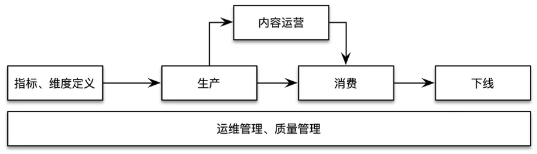

### 为什么需要数据指标体系

- 对于数据产品经理来说，搭建指标体系可以更好地梳理业务，提高问题分析效率。
- 对于研发来说，大数据平台统一关键指标业务口径及计算口径，统一企业业务目标，实现自上而下目标驱动。

## 如何设计指标体系

指标体系建设的常用方法是通过场景化进行指标体系的搭建，以用户的视角场景化思考，自上而下业务驱动指标体系建设，所以要在特定场景下做好指标体系建设，需要先选好指标，然后用科学的方法搭建指标体系。


### 定目标

这是第一步，也是最重要的一步，同时也是很多产品上线运营后进行评估的标准，并以此形成闭环。

好的目标具有以下三个特征：

- 与高层目标一致；
- 目标应当符合 SMART 原则；
- 具有挑战性。

### 用分析模型搭建指标体系

在《精益数据分析》一书中给出了两套比较常用的指标体系建设方法论，其中一个就是比较有名的海盗指标法，也就是我们经常听到的AARRR海盗模型。海盗模型是用户分析的经典模型，它反映了增长是系统性地贯穿于用户生命周期各个阶段的：用户拉新(Acquisition)、用户激活(Activation)、用户留存(Retention)、商业变现(Revenue)、用户推荐(Referral)。

#### AARRR模型

- A拉新
  通过各种推广渠道，以各种方式获取目标用户，并对各种营销渠道的效果评估，不断优化投入策略，降低获客成本。涉及关键指标：曝光量、点击、下载、安装、激活、安装率、激活率、注册转化率、留存率、付费率等。
- A活跃
  活跃用户指真正开始使用了产品提供的价值，我们需要掌握用户的行为数据，监控产品健康程度。这个模块主要反映用户进入产品的行为表现，是产品体验的核心所在。涉及关键指标：新老用户占比、DAU/WAU/MAU、日均登录次数、日均使用时长等。
- R留存
  衡量用户粘性和质量的指标。涉及关键指标：新用户留存率、老用户留存率、活跃用户留存率、日周月留存率、流失率等。
- R变现
  主要用来衡量产品商业价值。涉及关键指标：ARPU、ARPPU、付费率（区分新老用户）、客单价、LTV、GMV 等。
- R推荐
  主要是基于产品、营销、明星等事件的吸引力，从而使用户自发地传播。涉及关键指标例如邀请率、裂变系数等

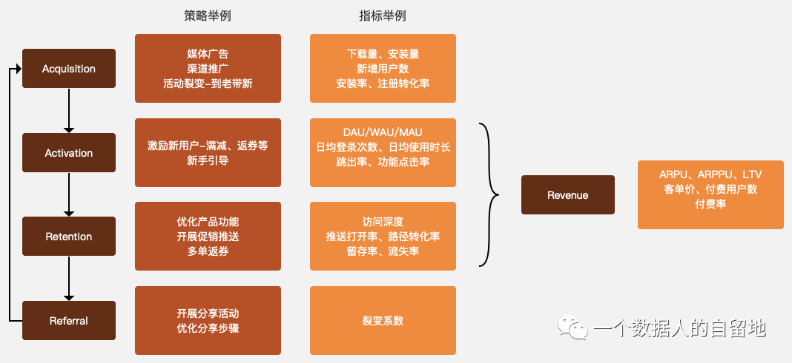

#### OSM模型

OSM模型（Obejective，Strategy，Measurement）是指标体系建设过程中辅助确定核心的重要方法，包含业务目标、业务策略、业务度量，是指标内容横向的思考。

- O 用户使用产品的目标是什么？产品满足了用户的什么需求？主要从用户视角和业务视角确定目标，原则是切实可行、易理解、可干预、正向有益
- S 为了达成上述目标我采取的策略是什么？
- M 这些策略随之带来的数据指标变化有哪些？

可以根据实际业务场景，结合使用OSM和AARRR模型，来系统性的选择不同阶段所需要的核心数据指标。

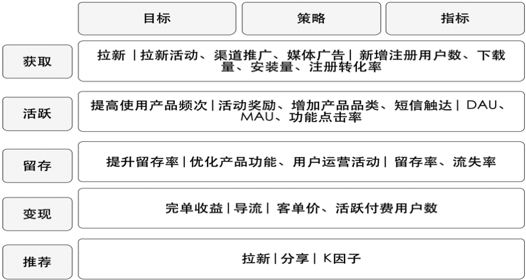

#### 指标分级

指标分级主要是将指标化解为不同层级并逐级分析。根据企业战略、企业组织及业务进行自上而下的分级，对指标进行层层剖析，其中可结合 OSM 模型来确定指标。

##### 一级指标：公司战略层 

用于衡量公司整体目标完成情况，与公司当前业务紧密结合，并对所有员工均有核心的指导意义。一级指标通常指引着公司的战略。

一级指标通常根据市场、产品生命周期、产品品类和商业模式确定，一个时间点只有一个最关键的指标（OMTM，One Metric That Matters）。

例如：小红书的OMTM（又称：北极星指标）如何演变？


##### 二级指标：业务策略层

为达成战略目标，公司会对其进一步拆解为业务线或事业群的核心指标；通常为了实现一级指标，企业会做出相应的策略，二级指标也会与这些策略有所关联。

例如：小红书当前的一级指标是销售额，那么二级指标可以设定为不同品类商品的销售额，分地区的销售额等；这样当一级指标出现问题的时候，我们可以快速定位问题所在。

##### 三级指标：业务执行层

三级指标是将二级指标纵向展开，进行路径拆解、漏斗拆解、公式拆解；三级指标通常用于定位二级指标的问题，通常指导一线运营或分析人员开展工作，三级指标是业务中最多的指标。

路径拆解需要对业务流程进行分析，例如：打开应用、浏览首页、浏览商品详情页、加入购物车、提交订单、订单支付、支付成功。

运用公式拆解月活跃用户，如下图。


### 场景化搭建指标体系

目前阶段互联网业务比较流行的一种通用抽象场景“人、货、场”，实际就是我们日常所说的用户、产品、场景，在通俗点讲就是谁在什么场景下使用了什么产品，不同的商业模式会有不同的组合模式。

以滴滴实际场景为例：哪些场景（此处场景定义为终端，如Native，微信，支付宝）的什么人（乘客）在平台上使用了哪些货（平台业务线，如快车/专车等），进而为评估用户增长的价值和效果。

#### 人的视角

从"人"的视角，我们比较关心的是什么乘客在什么时间打的车，排了多长时间，等了多长时间上车，周期内第几次打车，打车花了多少钱，是否有投诉和取消行为，具体到数据指标主要看发单用户数、完单用户数、客单价、周期内完单订单数、取消订单数、评价订单数等。

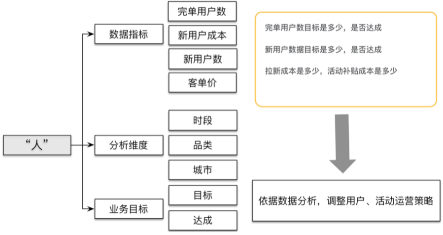

#### 货的视角

从"货"的视角，我们比较关心的就是成交了多少，交易额多少，花了多少，到具体数据指标主要会看GMV、成交率、取消率指标，在进一步会细分到城市、区域，一级品类、二级品类。数据的效果通过目标对比，横向对比、历史比较等方式进行分析确定。

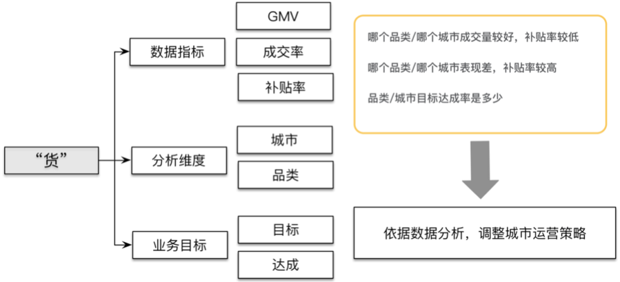

#### 场的视角

从"场"的视角，我们比较关心的就是哪个渠道用户点击量大曝光率大，带来了多少新用户，完成多少交易订单，客单价是多少；或者是哪个活动拉新或促活效果怎么样转化率多少，结合场景数据实际情况制定对应策略。


以上分别从"人"、"货"、"场"三个角度进行了数据指标和分析维度的提炼，下面我们把三类指标结合指标分级方法进行分解关联。

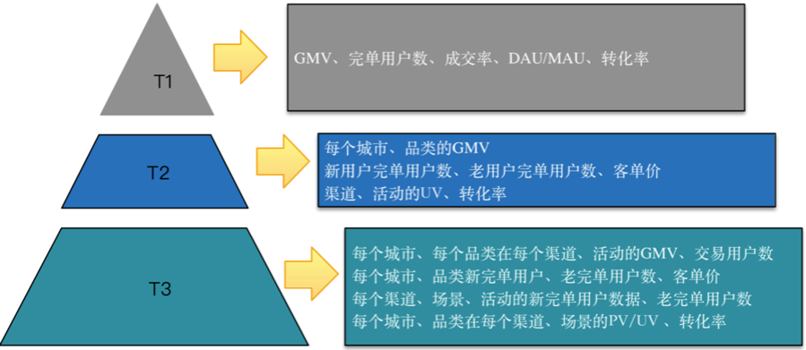

## 如何管理指标体系

### 痛点分析

主要从业务、技术、产品三个视角来看：

- 业务视角

  业务分析场景指标、维度不明确；

  频繁的需求变更和反复迭代，数据报表臃肿，数据参差不齐；

  用户分析具体业务问题找数据、核对确认数据成本较高。

- 技术视角

  指标定义，指标命名混乱，指标不唯一，指标维护口径不一致；

  指标生产，重复建设；数据汇算成本较高；

  指标消费，数据出口不统一，重复输出，输出口径不一致；

- 产品视角

  缺乏系统产品化支持从生产到消费数据流没有系统产品层面打通；

### 管理目标

- 技术目标  

  统一指标和维度管理，指标命名、计算口径、统计来源唯一， 维度定义规范、维度值一致

- 业务目标  
  统一数据出口、场景化覆盖

- 产品目标  
  指标体系管理工具产品化落地；指标体系内容产品化落地支持决策、分析、运营例如决策北极星、智能运营分析产品等

### 模型架构

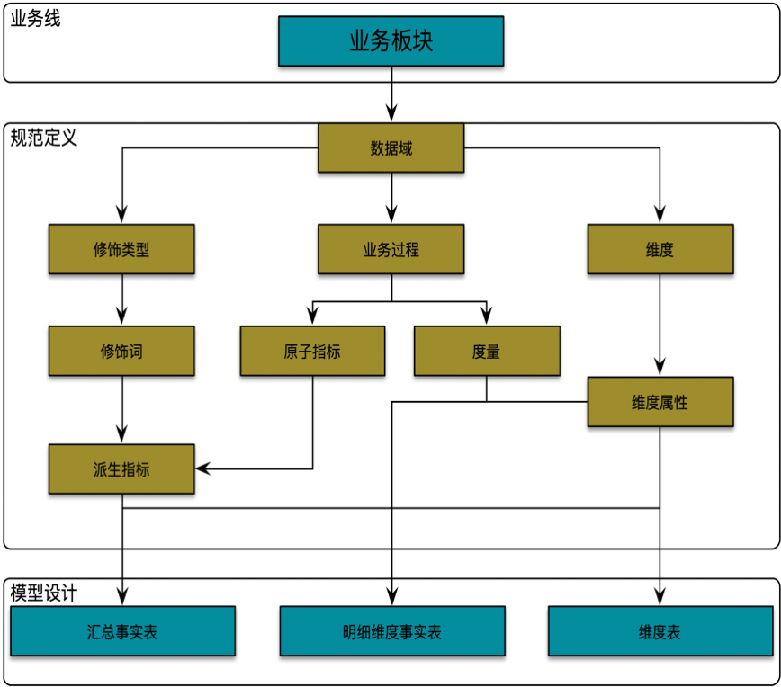

#### 业务线

业务板块定义原则：业务逻辑层面进行抽象、物理组织架构层面进行细分，可根据实际业务情况进行层级分拆细化，层级分级建议进行最多进行三级分拆，一级细分可公司层面统一规范确定，二级及后续拆分可根据业务线实际业务进行拆分。例如滴滴出行领域业务逻辑层面两轮车和四轮车都属于出行领域可抽象出行业务板块(level一级)，根据物理组织架构层面在进行细分普惠、网约车、出租车、顺风车（level二级），后续根据实际业务需求可在细分,网约车可细分独乘、合乘，普惠可细分单车、企业级。

**规范定义：**

- 数据域
  指面向业务分析，将业务过程或者维度进行抽象的集合。其中，业务过程可以概括为一个个不拆分的行为事件，在业务过程之下，可以定义指标；维度，是度量的环境，如乘客呼单事件，呼单类型是维度。为了保障整个体系的生命力，数据域是需要抽象提炼，并且长期维护更新的，变动需执行变更流程。

- 业务过程

  指公司的业务活动事件，如，呼单、支付都是业务过程。其中，业务过程不可拆分。

- 时间周期
- 用来明确统计的时间范围或者时间点，如最近30天、自然周、截止当日等。

- 修饰类型

  是对修饰词的一种抽象划分。修饰类型从属于某个业务域，如日志域的访问终端类型涵盖APP端、PC端等修饰词。

- 修饰词

  指的是统计维度以外指标的业务场景限定抽象，修饰词属于一种修饰类型，如在日志域的访问终端类型下，有修饰词APP、PC端等。

- 度量/原子指标

  原子指标和度量含义相同，基于某一业务事件行为下的度量，是业务定义中不可再拆分的指标，具有明确业务含义的名称，如支付金额。

- 维度

  维度是度量的环境，用来反映业务的一类属性，这类属性的集合构成一个维度，也可以称为实体对象。维度属于一个数据域，如地理维度（其中包括国家、地区、省市等）、时间维度（其中包括年、季、月、周、日等级别内容）。

- 维度属性

  维度属性隶属于一个维度，如地理维度里面的国家名称、国家ID、省份名称等都属于维度属性。

- 指标分类

  主要分为原子指标、派生指标、衍生指标

**原子指标**  
基于某一业务事件行为下的度量，是业务定义中不可再拆分的指标，具有明确业务含义的名称，如呼单量、交易金额

**派生指标**
是1个原子指标+多个修饰词（可选）+时间周期，是原子指标业务统计范围的圈定。派生指标又分以下二种类型：

1. - 事务型指标：
     是指对业务过程进行衡量的指标。例如，呼单量、订单支付金额，这类指标需要维护原子指标以及修饰词，在此基础上创建派生指标。

2. - 存量型指标：

3. 是指对实体对象（如司机、乘客）某些状态的统计，例如注册司机总数、注册乘客总数，这类指标需要维护原子指标以及修饰词，在此基础上创建派生指标，对应的时间周期一般为“历史截止当前某个时间”。

4. **衍生指标**
   是在事务性指标和存量型指标的基础上复合成的。主要有比率型、比例型、统计型均值 

#### 模型设计

主要采用维度建模方法进行构建，基础业务明细事实表主要存储维度属性集合和度量/原子指标；分析业务汇总事实表按照指标类别(去重指标、非去重指标)分类存储，非去重指标汇总事实表存储统计维度集合、原子指标或派生指标，去重指标汇总事实表只存储分析实体统计标签集合。

指标体系在数仓物理实现层面主要是结合数仓模型分层架构进行指导建设，指标数据主要存储在DWS层，作为指标的核心管理层。

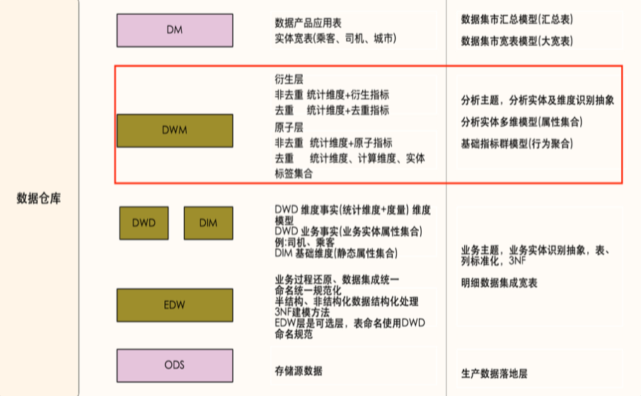

### 指标体系元数据管理

**维度管理：**

包括基础信息和技术信息，由不同角色进行维护管理。

- 基础信息对应维度的业务信息，由业务管理人员、数据产品或BI分析师维护，主要包括维度名称、业务定义、业务分类。
- 技术信息对应维度的数据信息，由数据研发维护，主要包括是否有维表（是枚举维度还是有独立的物理维表）、是否是日期维、对应code英文名称和中文名称、对应name英文名称和中文名称。如果维度有维度物理表，则需要和对应的维度物理表绑定，设置code和name对应的字段。如果维度是枚举维，则需要填写对应的code和name。维度的统一管理，有利于以后数据表的标准化，也便于用户的查询使用。

**指标管理：**

包括基础信息、技术信息和衍生信息，由不同角色进行维护管理。 

- 基础信息对应指标的业务信息，由业务管理人员、数据产品或BI分析师维护，主要包括归属信息(业务板块、数据域、业务过程)，基本信息(指标名称、指标英文名称、指标定义、统计算法说明、指标类型(去重、非去重))，业务场景信息(分析维度，场景描述)；
- 技术信息对应指标的物理模型信息，由数据研发进行维护，主要包括对应物理表及字段信息；
- 衍生信息对应关联派生或衍生指标信息、关联数据应用和业务场景信息，便于用户查询指标被哪些其它指标和数据应用使用，提供指标血缘分析追查数据来源的能力。

原子指标定义归属信息 + 基本信息 + 业务场景信息

派生指标定义时间周期 + 修饰词集合 + 原子指标

修饰类型主要包含类型说明、统计算法说明、数据源(可选)

## 实时指标定义与模型设计

假设我们是一个初创型的电商互联网公司，涉及APP、小程序、Web等终端应用。作为整个公司指标体系的一部分，实时指标的管理方式和离线数仓中的指标是完全一致的，一般会有30% - 40%的公司核心指标会做实时指标，作为实时监控大屏、实时数据看板等。不同的互联网行业会关注不同的运营数据，细化来看，复杂的互联网产品关注的运营指标成百上千。但有一些指标时最常用的，这些指标反映了运营的核心状态。

下面介绍几个常见的互联网运营指标，各位看官可以结合AARRR模型来理解这些指标含义：

- 新增用户数 

  新增用户数是网站增长性的关键指标，指新增加的访问网站的用户数（或者新下载 App 的用户数），对于一个处于爆发期的网站，新增用户数会在短期内出现倍增的走势，是网站的战略机遇期，很多大型网站都经历过一个甚至多个短期内用户暴增的阶段。新增用户数有日新增用户数、周新增用户数、月新增用户数等几种统计口径。

- 用户留存率

  新增的用户并不一定总是对网站（App）满意，在使用网站（App）后感到不满意，可能会注销账户（卸载 App），这些辛苦获取来的用户就流失掉了。网站把经过一段时间依然没有流失的用户称作留存用户，留存用户数比当期新增用户数就是用户留存率。

  ```
  用户留存率 = 留存用户数 / 当期新增用户数
  ```

  

  当期新增用户数计算留存有时间窗口，即和当期数据比，3 天前新增用户留存的，称作 3 日留存；相应的，还有 5 日留存、7 日留存等。新增用户可以通过广告、促销、病毒营销等手段获取，但是要让用户留下来，就必须要使产品有实打实的价值。用户留存率是反映用户体验和产品价值的一个重要指标，一般说来，3 日留存率能做到 40% 以上就算不错了。和用户留存率对应的是用户流失率。

  ```
  用户流失率 = 1 - 用户留存率
  ```

- 活跃用户数

  用户下载注册，但是很少打开产品，表示产品缺乏黏性和吸引力。活跃用户数表示打开使用产品的用户数，根据统计口径不同，有日活跃用户数、月活跃用户数等。提升活跃是网站运营的重要目标，各类 App 常用推送优惠促销消息给用户的手段促使用户打开产品。

- PV

  打开产品就算活跃，打开以后是否频繁操作，就用 PV 这个指标衡量，用户每次点击，每个页面跳转，被称为一个 PV（Page View）。PV 是网页访问统计的重要指标，在移动 App 上，需要进行一些变通来进行统计。

- GMV 

  即成交总金额（Gross Merchandise Volume），是电商网站统计营业额（流水）、反映网站营收能力的重要指标。和 GMV 配合使用的还有订单量（用户下单总量）、客单价（单个订单的平均价格）等。

- 转化率

  ```
  转化率 = 有购买行为的用户数 / 总访问用户数
  ```

  用户从进入网站（App）到最后购买成功，可能需要经过复杂的访问路径，每个环节都有可能会离开：进入首页想了想没什么要买的，然后离开；搜索结果看了看不想买，然后离开；进入商品详情页面，看看评价、看看图片、看看价格，然后离开；放入购物车后又想了想自己的钱包，然后离开；支付的时候发现不支持自己喜欢的支付方式，然后离开…一个用户从进入网站到支付，完成一笔真正的消费，中间会有很大概率流失，网站必须要想尽各种办法：个性化推荐、打折促销、免运费、送红包、分期支付，以留住用户，提高转化率。以上是一些具有普适性的网站运营数据指标，具体到不同的网站根据自身特点，会有自己的指标。比如百度可能会关注“广告点击率”这样的指标，游戏公司可能会关注“付费玩家数”这样的指标。每个产品都应该根据自身特点寻找能够反映自身运营状况的数据指标。为了便于分析决策，这些指标通常会以图表的方式展示，即数据可视化。

### 实时指标定义

实时指标的定义，也就是公司有哪些核心的指标数据需要实时展示，协助分析、运营人员查看运营效果，从而改变运营策略，另一方面，实时的指标数据做成实时大屏展示也能展示公司的实力。一般来说，实时指标的定义会有产品编写规范的PRD文档，研发和产品沟通确定实时指标。但不是`人人不是产品经理`吗！以下结合AARRR模型、OSM模型以及结合自身的理解，将实时指标分为以下几类：

#### 基础指标监控

一般是公司从老板到运营到研发都会关注的一级指标，也就是核心KPI。

**交易域**

- 订单金额
- 下单人数
- 客单价
- 新客人数
- GMV
- 商品销量
- 商品销售金额
- 复购

**用户域**

可以从AARRR模型出发

- 新增注册用户数
- 活跃用户数
- 留存率/流失率
- 用户参与度
  - 人均启动APP次数
  - 人均使用时长

**流量域**

- PV：页面访问次数

以上只是列出了一些常见的一级指标，基于这些指标，已经可以支撑比较丰富的数据看板了。实时上，在实时监控大屏中，有两种数据指标的展现方式：

一种是直接对原子指标展示，如以上的：

- 当日订单金额，并配置同比、环比

- 当日下单人数，并配置同比、环比

  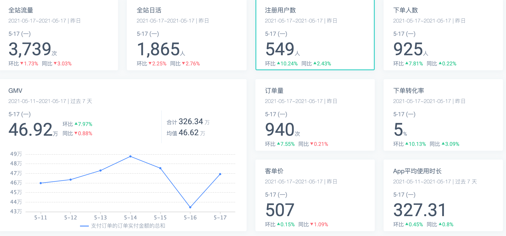

除了原子指标，更多的时候是一些派生的指标的展示，如在数仓建模过程中，完成了维度丰富的DWD层明细数据，往往关注的指标如：

- 小时级不同设备终端的活跃用户数

- 小时级订单金额

- 小时级不同渠道进来的新用户数

  

#### 业务关键指标

如用户行为分析中，用户实时的点击、收藏、加购、下单次数等；

### 实时数仓DWS

说到这里，先看看离线数仓的DWS的含义。数据仓库汇总层数据(Data Warehouse Summary)，基于指标需求，构建初步汇总事实表，一般是宽表。基于上层的应用和产品的指标需求，构建公共粒度的汇总指标表。以宽表化手段物理化模型，构建命名规范、口径一致的统计指标，为上层提供公共指标。

#### DWS的基本特点

- DWS层是面向分析维度进行设计的，分析维度通常是业务经常需要的看数据的角度。
- DWS层的指标要保持命名和口径一致，避免ADS层的指标数据混乱
- DWS是公共汇总层，提供不同维度的统计指标，指标的口径要保持一致，并且要提供详细的描述
- 以宽表的形式进行设计，比如相同粒度的统计指标可以放在一起，避免创建太多的表
- 公共汇总层的一个表通常会对应一个派生指标
- DWS存储派生指标(统计周期+修饰词+统计粒度+原子指标)，原子指标存储在DWD层的事实表中

#### DWS设计步骤

- 首先，确定聚集维度，即确定统计粒度，比如商品粒度

- 然后，确定统计周期，比如小时

- 最后，确定聚集事实，即派生指标

  ```sql
  CREATE TABLE IF NOT EXISTS dws_asale_trd_itm_ord_1h
  (
      item_id                 BIGINT COMMENT '商品ID',
      item_title              STRING COMMENT '商品名称',
      cate_id                 BIGINT COMMENT '商品类目ID',
      cate_name           STRING COMMENT '商品类目名称',
      mord_prov            STRING COMMENT '收货人省份',
      confirm_paid_amt_sum_1d DOUBLE COMMENT '最近一小时订单已经确认收货的金额总和'
  )
  COMMENT '商品粒度交易最近一小时汇总事实表'
  WITH (...)
  ```

#### 实时数仓DWS汇总层建设

在建设实时数仓汇总层的时候，跟离线数仓的分层设计上是一致的，但其具体技术实现会有很大不同。

- 第一：对于一些共性指标的加工，比如`pv，uv，订单业务过程指标`等，会在汇总层进行统一的运算，确保关于指标的口径是统一在一个固定的模型中完成。对于一些个性指标，从指标复用性的角度出发，确定唯一的时间字段，同时该字段尽可能与其他指标在时间维度上完成拉齐，例如行中异常订单数需要与交易域指标在事件时间上做到拉齐。
- 第二：在实际汇总层建设中，需要进行多维的主题汇总，因为实时数仓本身是面向主题的，可能每个主题会关心的维度都不一样，所以需要在不同的主题下，按照这个主题关心的维度对数据进行汇总，最后来算业务方需要的汇总指标。在具体操作中：
  - 对于pv类指标使用Flink SQL实现分钟汇总指标作为最小汇总单位指标(具体的时间统计周期也就是窗口大小的选择取决于业务方对指标数据时效性的要求)，在此基础上进行时间维度上的指标累加；
  - 对于uv类指标,直接KV数据库作为指标汇总容器，如HBase或者Redis，然后基于此提供API数据服务。
- 第三：汇总层建设过程中，还会涉及到衍生维度的加工。在汇总指标加工中可以使用Hbase的版本机制来构建一个衍生维度的拉链表，通过事件流和Hbase维表关联的方式得到实时数据当时的准确维度

#### 关于建设DWS的一些问题

一般在离线数仓中，一张DWS表通常只会对应一个派生指标，在设计DWS表的时候，很多人会把所有可以聚合的维度进行cube，这样就得到了很多个派生指标，而这些派生指标放在同一张表中无疑会增加这张表的使用难度，比如在实际的取数时，往往只关心某个统计粒度的指标。实际上cube的数据尽量放在ADS层，这样在开发数据接口或者应用层取数时都会比较方便。

但实时计算是一个讲究延迟性，且实时数仓层级过多会造成任务依赖、复杂度变高，所以实时数仓又会强调尽量减少分层。所以个人任务，设计实时数仓，不应该照搬离线数仓的一套理论，比如在设计DWS表的时候，完全把所有可以聚合的维度进行cube，因为派生指标一个任务一个任务的算，而实时任务会7 * 24小时运行，无疑会增加很多额外计算资源，完全可以考虑将可以所有可以聚合的维度进行cube，比如计算小时级商品销量，可以将每小时商品销量、商品销售金额这两个派生指标放在一个表里。

甚至直接由DWD -> ADS，将ADS指标数据存外部数据库，提供API服务。

## 实时指标开发

### Flink Sql简单介绍

> 以下文档粘贴于官方文档，Flink的官方文档非常详细，建议开发之前读两遍官方文档。

在之前的案例中，都是使用Flink DataStream进行业务需求开发的，但随着最近两年Flink Sql在社区的发展、SQL开发的便捷，各大小公司都在做基于Flink Sql的实时计算平台。在本项目中，实时指标计算与Flink Sql完美契合，一般实时指标的开发都是基于平台开发，这里不关注如何搭建一个简单的实时计算平台，下面简单介绍一下Flink Sql中的一些概念：

#### 动态表 & 连续查询(Continuous Query)

*动态表* 是 Flink 的支持流数据的 Table API 和 SQL 的核心概念。与表示批处理数据的静态表不同，动态表是随时间变化的。可以像查询静态批处理表一样查询它们。查询动态表将生成一个 *连续查询* 。一个连续查询永远不会终止，结果会生成一个动态表。查询不断更新其(动态)结果表，以反映其(动态)输入表上的更改。本质上，动态表上的连续查询非常类似于定义物化视图的查询。

需要注意的是，连续查询的结果在语义上总是等价于以批处理模式在输入表快照上执行的相同查询的结果。

下图显示了流、动态表和连续查询之间的关系:


1. 将流转换为动态表。
2. 在动态表上计算一个连续查询，生成一个新的动态表。
3. 生成的动态表被转换回流。

**注意：** 动态表首先是一个逻辑概念。在查询执行期间不一定(完全)物化动态表。

在下面，我们将解释动态表和连续查询的概念，并使用具有以下模式的单击事件流:

```
[
  user:  VARCHAR,   // 用户名
  cTime: TIMESTAMP, // 访问 URL 的时间
  url:   VARCHAR    // 用户访问的 URL
]
```

#### 在流上定义表

为了使用关系查询处理流，必须将其转换成 `Table`。从概念上讲，流的每条记录都被解释为对结果表的 `INSERT` 操作。本质上我们正在从一个 `INSERT`-only 的 changelog 流构建表。

下图显示了单击事件流(左侧)如何转换为表(右侧)。当插入更多的单击流记录时，结果表将不断增长。


**注意：** 在流上定义的表在内部没有物化。

#### 连续查询

------

在动态表上计算一个连续查询，并生成一个新的动态表。与批处理查询不同，连续查询从不终止，并根据其输入表上的更新更新其结果表。在任何时候，连续查询的结果在语义上与以批处理模式在输入表快照上执行的相同查询的结果相同。

在接下来的代码中，我们将展示 `clicks` 表上的两个示例查询，这个表是在点击事件流上定义的。

第一个查询是一个简单的 `GROUP-BY COUNT` 聚合查询。它基于 `user` 字段对 `clicks` 表进行分组，并统计访问的 URL 的数量。下面的图显示了当 `clicks` 表被附加的行更新时，查询是如何被评估的。


当查询开始，`clicks` 表(左侧)是空的。当第一行数据被插入到 `clicks` 表时，查询开始计算结果表。第一行数据 `[Mary,./home]` 插入后，结果表(右侧，上部)由一行 `[Mary, 1]` 组成。当第二行 `[Bob, ./cart]` 插入到 `clicks` 表时，查询会更新结果表并插入了一行新数据 `[Bob, 1]`。第三行 `[Mary, ./prod?id=1]` 将产生已计算的结果行的更新，`[Mary, 1]` 更新成 `[Mary, 2]`。最后，当第四行数据加入 `clicks` 表时，查询将第三行 `[Liz, 1]` 插入到结果表中。

第二条查询与第一条类似，但是除了用户属性之外，还将 `clicks` 分组至[每小时滚动窗口](https://ci.apache.org/projects/flink/flink-docs-release-1.12/zh/dev/table/sql/#group-windows)中，然后计算 url 数量(基于时间的计算，例如基于特定[时间属性](https://ci.apache.org/projects/flink/flink-docs-release-1.12/zh/dev/table/streaming/time_attributes.html)的窗口，后面会讨论)。同样，该图显示了不同时间点的输入和输出，以可视化动态表的变化特性。


与前面一样，左边显示了输入表 `clicks`。查询每小时持续计算结果并更新结果表。clicks表包含四行带有时间戳(`cTime`)的数据，时间戳在 `12:00:00` 和 `12:59:59` 之间。查询从这个输入计算出两个结果行(每个 `user` 一个)，并将它们附加到结果表中。对于 `13:00:00` 和 `13:59:59` 之间的下一个窗口，`clicks` 表包含三行，这将导致另外两行被追加到结果表。随着时间的推移，更多的行被添加到 `click` 中，结果表将被更新。

#### 更新和追加查询

虽然这两个示例查询看起来非常相似(都计算分组计数聚合)，但它们在一个重要方面不同:

- 第一个查询更新先前输出的结果，即定义结果表的 changelog 流包含 `INSERT` 和 `UPDATE` 操作。
- 第二个查询只附加到结果表，即结果表的 changelog 流只包含 `INSERT` 操作。

一个查询是产生一个只追加的表还是一个更新的表有一些含义:

- 产生更新更改的查询通常必须维护更多的状态(请参阅以下部分)。
- 将 append-only 的表转换为流与将已更新的表转换为流是不同的(参阅[表到流的转换](https://ci.apache.org/projects/flink/flink-docs-release-1.12/zh/dev/table/streaming/dynamic_tables.html#table-to-stream-conversion)章节)。

### 需求

详细指标参考以上指标定义，下面以几个指标为例：

**实时监控大屏**

- 实时订单金额
- 实时下单人数
- 实时UV
- 实时PV

**实时指标**

- 渠道维度分时新增用户

  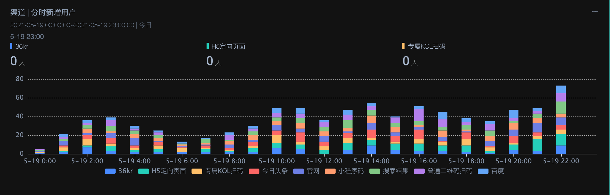

- 商品维度分时销售金额
- 终端维度分时PV

### 数据开发

#### 创建DWD层Kafka源表

**交易域订单明细表**：定义允许延迟5秒的watermark

```sql
CREATE TABLE dwd_order_detail (
  ts BIGINT,
  detail_id STRING,
  order_id STRING,
  sku_id STRING,
  sku_name STRING,
  sku_num STRING,
  order_price STRING,
  source_type STRING,
  province_id STRING,
  user_id STRING,
  order_status STRING,
  total_amount STRING,
  activity_reduce_amount STRING,
  coupon_reduce_amount STRING,
  original_total_amount STRING,
  feight_fee STRING,
  split_total_amount STRING,
  split_activity_amount STRING,
  split_coupon_amount STRING,
  create_time TIMESTAMP(3),
  operate_time TIMESTAMP(3),
  expire_time TIMESTAMP(3),
  coupon_id STRING,
  province_name STRING,
  province_area_code STRING,
  province_iso_code STRING,
  province_3166_2_code STRING,
  user_birthday STRING,
  user_gender STRING,
  user_login_name STRING,
  spu_id STRING,
  tm_id STRING,
  category3_id STRING,
  spu_name STRING,
  tm_name STRING,
  category3_name STRING,
  dt STRING,
  WATERMARK FOR `create_time` AS `create_time` - INTERVAL '5' SECOND
)
COMMENT '订单明细宽表'
WITH (
  'connector' = 'kafka',
  'format' = 'json',
  'properties.bootstrap.servers' = 'localhost:9092',
  'properties.group.id' = 'dwd-dws',
  'scan.startup.mode' = 'earliest-offset',
  'topic' = 'dwd_order_detail'
)
```

**流量域**

在前面`流量数据DWD层`的建设中，一共做了3张关于埋点的用户行为事件表，分别是：

- 用户行为-点击事件明细表
- 用户行为-曝光事件明细表
- 用户行为-页面浏览明细表

本次案例中，这三张表的数据结构均一致，以点击事件用细表为例，创建一张点击事件明细Kafka源表：

```sql
CREATE TABLE dwd_user_action_log	(
 event STRING COMMENT '事件',
 event_name STRING COMMENT '时间名称',
 user_id STRING COMMENT '用户ID',
 distinct_id STRING COMMENT '唯一ID',
 event_time BIGINT COMMENT '事件时间',
 event_time_stamp TIMESTAMP(3) COMMENT '事件时间戳',
 app_name STRING COMMENT '应用端',
 app_version STRING COMMENT '应用的版本',
 is_login STRING COMMENT '是否首次登陆',
 is_vip STRING COMMENT '是否VIP',
 wifi STRING COMMENT '是否wifi',
 page_title STRING COMMENT '所在页面',
 page_type STRING COMMENT '页面类型',
 platform_type STRING COMMENT '平台类型',
 store_id STRING COMMENT '门店ID',
 store_name STRING COMMENT '门店名称',
 supplier_id STRING COMMENT '供应商ID',
 supplier_name STRING COMMENT '供应商名称',
 room_id STRING COMMENT '直播间id',
 room_name STRING COMMENT '直播间名称',
 vip_level STRING COMMENT 'VIP等级',
 lib STRING COMMENT 'SDK类型，例如python、iOS等',
 browser STRING COMMENT '浏览器名，例如Chrome',
 browser_version STRING COMMENT '浏览器版本，例如Chrome 45',
 carrier STRING COMMENT '运营商名称，例如ChinaNet',
 province STRING,
 city STRING,
 country STRING,
 os STRING COMMENT '操作系统，例如iOS',
 os_version STRING COMMENT '操作系统版本，例如8.1.1',
 model STRING COMMENT '设备型号，例如iphone6',
 utm_campaign STRING COMMENT '广告系列名称',
 utm_content STRING COMMENT '广告系列内容',
 utm_matching_type STRING COMMENT '渠道追踪匹配模式',
 utm_medium STRING COMMENT '广告系列媒介',
 utm_source STRING COMMENT '广告系列来源',
 utm_term STRING COMMENT '广告系列字词',
 url STRING COMMENT 'url',
 referrer STRING COMMENT '向前地址',
 scene STRING COMMENT '启动场景',
 spu_id STRING COMMENT '商品ID',
 spu_name STRING COMMENT '商品名',
 spu_quantity BIGINT COMMENT '商品数量',
 WATERMARK FOR `event_time_stamp` AS `event_time_stamp` - INTERVAL '5' SECOND
)
COMMENT '订单明细宽表'
WITH (
  'connector' = 'kafka',
  'format' = 'json',
  'properties.bootstrap.servers' = 'localhost:9092',
  'properties.group.id' = 'dwd-dws',
  'scan.startup.mode' = 'earliest-offset',
  'topic' = 'dwd_user_action_log'
)
```

#### UV类指标

该类指标如：当天页面的访问人数、下单人数、新客人数等，需要对用户做精准去重，且直接做数据大屏展示。所以DWS层的设计中，直接使用KV数据库来存储指标的聚合值，一个思路是可以使用HBase的列可以动态扩展的特性，或者redis的Hash结构存储，将此类指标统一存储到一张Hash表中，减少重复建表等开发。

值的一提的是，Flink社区并没有实现`flink-sql-redis-connector`,需要自己实现；或者到github找一个开源项目，但一般需要二次开发才能用。

##### 指标需求

1. 实时UV指标

对该指标进行梳理：统计维度是app_id/app_name，事件周期为当天，派生指标为不同端当天(实时)UV。

- 创建Redis结果表,并设置key的TTL为7天

  ```sql
  create table dws_core_point (
    key STRING,
    field STRING,
    value STRING,
    PRIMARY KEY (key) NOT ENFORCED
  ) with (
    'connector' = 'redis',
    'mode' = 'hashmap',
    'host' = '${Config.redisHost}',
    'port' = '6379',
    'password' = '${Config.redisPassword}',
    'dbNum' = '0',
    'key.ttl' = '604800'
  )
  ```

- Flink SQL任务基于event_time计算当日uv并写入Redis的hash结构中

  ```sql
  INSERT INTO dws_core_point
  SELECT
   CONCAT_WS(':', 'dws_core_point', DATE_FORMAT(event_time_stamp, 'yyyyMMdd')),
   'uv',
   CAST(COUNT(DISTINCT(user_id)) AS STRING)
  FROM dwd_user_action_log
  GROUP BY CONCAT_WS(':', 'dws_core_point', DATE_FORMAT(event_time_stamp, 'yyyyMMdd'))
  ```

- 查看redis中的数据，uv指标数据实时更新

  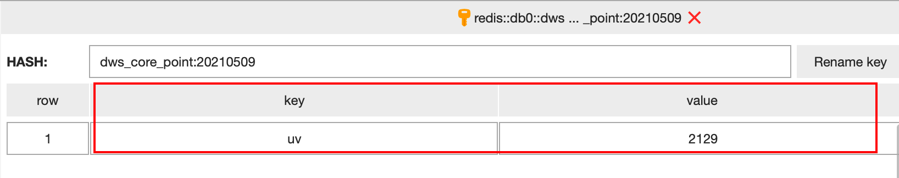

2. 下单人数、新客人数等指标的计算方式和UV指标的计算方式一致，当然指标结果也可以使用HBase存储，参考官方文档开发就行。

#### PV类指标

对于pv类指标使用Flink SQL实现分钟汇总指标作为最小汇总单位指标(具体的时间统计周期也就是窗口大小的选择取决于业务方对指标数据时效性的要求)，在此基础上进行时间维度上的指标累加。

