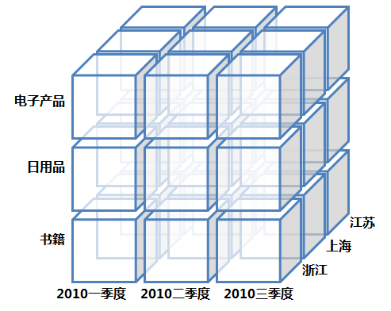
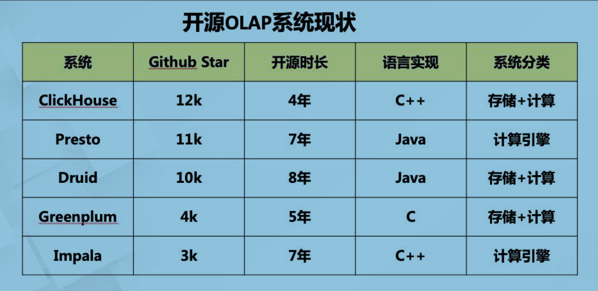
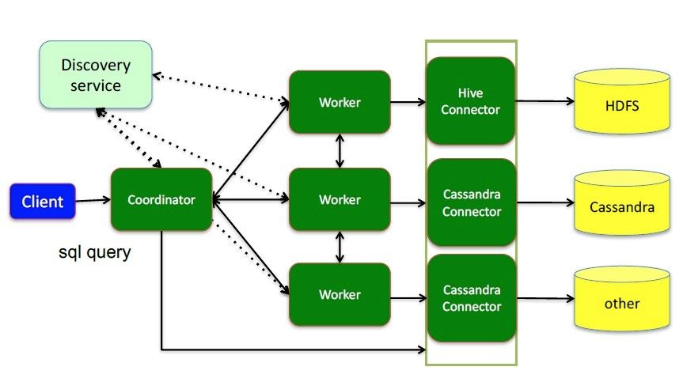
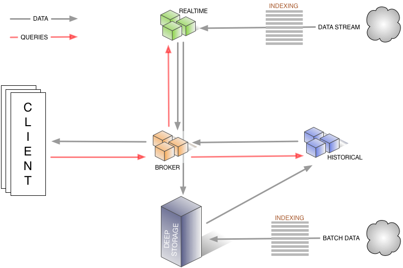
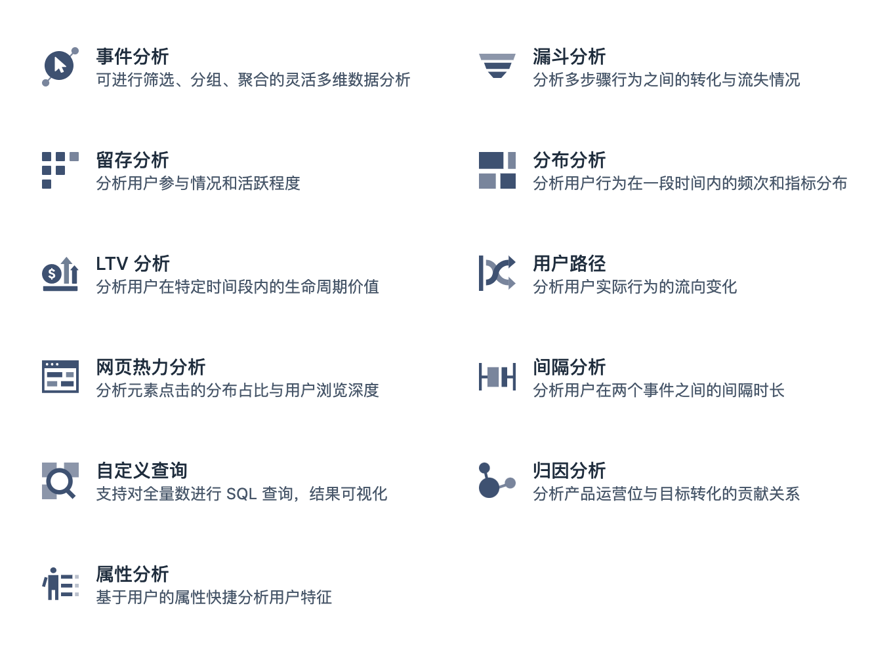

`写在前面`

在实时数仓的应用场景中，除了实时数据指标平台以外，实时OLAP应该算是最重要的场景了。以下也会从数据产品的角度出发，理解数据分析需求，从0到1设计、搭建一个实时OLAP系统。

一些技术文章：

> [1.Kylin与ClickHouse的对比](https://mp.weixin.qq.com/s/TyeT1JvV1NZRJW5dIiV4zA)
>
> [2.Kylin、Druid、ClickHouse核心技术对比](https://mp.weixin.qq.com/s/unGF2-D7_HhIK8qZu7Vz0Q)

## OLAP简介

### 什么是OLAP

**OLAP是Online analytical processing的英文缩写，指联机分析处理**。从字面上可以看出是做分析类操作。通过分析数据库中的数据来得出一些结论性的东西。比如给老总们看的报表，用于进行市场开拓的用户行为统计，不同维度的汇总分析结果等等。操作主体一般是运营、产品和数据分析师等团队人员而不是用户。区别于OLTP，On-Line Transaction Processing，联机事务处理。

- OLTP和OLAP的简单总结：

  |          | OLTP                       | OLAP                       |      |
  | -------- | -------------------------- | -------------------------- | ---- |
  | 操作对象 | 数据库                     | 数据仓库                   |      |
  | 数据量   | 较小                       | 较大                       |      |
  | 数据模型 | 实体-关系(ER)              | 星型或雪花型               |      |
  | 数据时效 | 当前数据                   | 当前及历史数据             |      |
  | 数据操作 | 支持DDL/DML                | 一般不支持更新和删除       |      |
  | 操作粒度 | 记录型                     | 涉及多表                   |      |
  | 性能要求 | 高吞吐，低延迟             | 性能要求相对较低           |      |
  | 操作目的 | 增删改查                   | 分析                       |      |
  | 业务类型 | 面对用户：账户查询，转账等 | 面对业务：统计，多维度分析 |      |

数据仓库与OLAP的关系是互补的，现代OLAP系统一般以数据仓库作为基础，即从数据仓库中抽取详细数据的一个子集并经过必要的聚集存储到OLAP存储器中供前端分析工具读取。

### OLAP的基本操作

#### 数据立方体

中国作为信息技术领域的后起之秀，我们现在介绍的这些概念都源于英文。数据立方体就是从英文“Data Cube”而来。下图就是一个商品销售模型的数据立方体。

其实也可以叫它”数据魔方体“，因为立方体是三维的，而多维数据模型并不仅仅三维，虽然受图形化展示限制，一般仅展示其三个维度。而”魔方“一词，则凸现出了其变化性，通过对其进行不同的操作，让数据呈现出千变万化的结果。

上图来源于参考资料，比较好展示了多维模型，从大立方体上可以看到商品类型、季度和地区三个维度。但对于每个维度又是一个小立方体，比如第一季度浙江的书籍销售情况就是左下角的小立方体。在这个小立方体中，根据需要，我们还可以按照书籍类型，从季度拆分为月度，浙江拆出各地级市。

#### OLAP的操作

OLAP的操作是以查询——也就是数据库的SELECT操作为主，但是查询可以很复杂，比如基于关系数据库的查询可以多表关联，可以使用COUNT、SUM、AVG等聚合函数。OLAP正是基于多维模型定义了一些常见的面向分析的操作类型是这些操作显得更加直观。

OLAP的多维分析操作包括：`钻取（Drill-down）`、`上卷（Roll-up）`、`切片（Slice）`、`切块（Dice）`以及`旋转（Pivot）`

- **钻取（Drill-down）**：在维的不同层次间的变化，从上层降到下一层，或者说是将汇总数据拆分到更细节的数据，比如通过对2010年第二季度的总销售数据进行钻取来查看2010年第二季度4、5、6每个月的消费数据，如上图；当然也可以钻取浙江省来查看杭州市、宁波市、温州市……这些城市的销售数据。
- **上卷（Roll-up）**：钻取的逆操作，即从细粒度数据向高层的聚合，如将江苏省、上海市和浙江省的销售数据进行汇总来查看江浙沪地区的销售数据，如上图。
- **切片（Slice）**：选择维中特定的值进行分析，比如只选择电子产品的销售数据，或者2010年第二季度的数据。
- **切块（Dice）**：选择维中特定区间的数据或者某批特定值进行分析，比如选择2010年第一季度到2010年第二季度的销售数据，或者是电子产品和日用品的销售数据。
- **旋转（Pivot）**：即维的位置的互换，就像是二维表的行列转换，如图中通过旋转实现产品维和地域维的互换。

### OLAP分类

一般来说OLAP根据建模方式可分为MOLAP、ROLAP和HOLAP 3种类型，下面分别进行介绍并分析优缺点。

#### MOLAP

基于多维数组的存储模型，也是OLAP最初的形态，特点是对数据进行预计算，以空间换效率，明细和聚合数据都保存在cube中。但生成cube需要大量时间和空间。

由于所有可能结果均已计算出来并持久化存储，查询时无需进行复杂计算，且以数组形式可以进行高效的免索引数据访问，因此用户发起的查询均能够稳定地快速响应。这些结果集是高度结构化的，可以进行压缩/编码来减少存储占用空间。

但高性能并不是没有代价的。首先，MOLAP需要进行预计算，这会花去很多时间。如果每次写入增量数据后均要进行全量预计算，显然是低效率的，因此支持仅对增量数据进行迭代计算非常重要。其次，如果业务发生需求变更，需要进行预定模型之外新的查询操作，现有的MOLAP实例就无能为力了，只能重新进行建模和预计算。

因此，**MOLAP适合业务需求比较固定，数据量较大的场景**。在开源软件中，由eBay开发并贡献给Apache基金会的Kylin即属于这类OLAP引擎，支持在百亿规模的数据集上进行亚秒级查询。

**Kylin的构建步骤**

- 确定Hadoop上的星型/雪花模式。
- 2个从已识别的表中构建多维数据集。
- 3通过ODBC，JDBC或RESTful API使用ANSI-SQL查询并在不到一秒的时间内获得结果。

其架构图较直观得反映了基于cube的预计算模型（build），如下所示：

**Kylin的特性：**

- 可扩展超快olap引擎，Hadoop/Spark上百亿数据规模
-  提供 Hadoop ANSI SQL 接口
-  交互式查询能力，用户可以与Hadoop数据进行亚秒级交互
-  百亿以上数据集构建多维立方体（MOLAP CUBE）
- 与BI工具无缝整合，如Tableau，PowerBI/Excel，MSTR，QlikSense，Hue和SuperSet

#### ROLAP

与MOLAP相反，ROLAP无需预计算，直接在构成多维数据模型的事实表和维度表上进行计算。R即表示关系型（Relational）。显然，这种方式相比MOLAP更具可扩展性，增量数据导入后，无需进行重新计算，用户有新的查询需求时只需写好正确的SQL语句既能完成获取所需的结果。

但ROLAP的不足也很明显，尤其是在数据体量巨大的场景下，用户提交SQL后，获取查询结果所需的时间无法准确预知，可能秒回，也可能需要花费数十分钟甚至数小时。本质上，ROLAP是把MOLAP预计算所需的时间分摊到了用户的每次查询上，肯定会影响用户的查询体验。当然ROLAP的性能是否能够接受，取决于用户查询的SQL类型，数据规模以及用户对性能的预期。

相比MOLAP，ROLAP的使用门槛更低，在完成星型或雪花型模型的构建，创建对应schema的事实表和维度表并导入数据后，用户只需会写出符合需求的SQL，就可以得到想要的结果。相比创建“数据立方体”，显然更加方便。

目前使用ROLAP的公司多一些，更灵活易用。

#### HSAP

HSAP是最近阿里云提出的一种分析、服务一体化的架构。SAP 是指Hybrid serving and analytical processing，理念是能够支持这种很高QPS 的Serverless 场景的查询写入，并且将复杂的分析场景在一套体系里面完成，hologres是代表作品。

### OLAP的核心设计

#### MPP架构

MPP (Massively Parallel Processing)，即大规模并行处理。简单来说，MPP是将任务并行的分散到多个服务器和节点上，在每个节点上计算完成后，将各自部分的结果汇总在一起得到最终的结果(与Hadoop相似)。平时熟悉的Impala、ClickHouse、Druid、Doris等都是MPP架构

**MPP架构特征**

- 任务并行执行
- 数据分布式存储(本地化)
- 分布式计算
- 私有资源
- 横向扩展
- Shared Nothing架构

#### 向量化执行引擎

火山引擎与向量化执行引擎后面慢慢了解后再总结。

### 开源ROLAP产品

从技术影响力的角度来说，Github Star 排名前5 的系统也是目前市面上比较流行的开源OLAP 系统，它们的开源时间以及产品的定位各不相同。

目前生产环境使用较多的开源ROLAP主要可以分为2大类，一个是宽表模型，另一个是多表组合模型（就是前述的星型或雪花型）。

**宽表模型**

宽表模型能够提供比多表组合模型更好的查询性能，不足的是支持的SQL操作类型比较有限，比如对Join等复杂操作支持较弱或不支持。

目前该类OLAP系统包括Druid和ClickHouse等，两者各有优势，Druid支持更大的数据规模，具备一定的预聚合能力，通过倒排索引和位图索引进一步优化查询性能，在广告分析场景、监控报警等时序类应用均有广泛使用；ClickHouse部署架构简单，易用，保存明细数据，依托其向量化查询、减枝等优化能力，具备强劲的查询性能。两者均具备较高的数据实时性，在互联网企业均有广泛使用。

除了上面介绍的Druid和ClickHouse外，ElasticSearch和Solar也可以归为宽表模型。但其系统设计架构有较大不同，这两个一般称为搜索引擎，通过倒排索引，应用Scatter-Gather计算模型提高查询性能。对于搜索类的查询效果较好，但当数据量较大或进行扫描聚合类查询时，查询性能会有较大影响。

**多表组合模型**

采用星型或雪花型建模是最通用的一种ROLAP系统，常见的包括`GreenPlum、Presto和Impala`等，他们均基于MPP架构，采用该模型和架构的系统具有支持的数据量大、扩展性较好、灵活易用和支持的SQL类型多样等优点。

相比其他类型ROLAP和MOLAP，该类系统性能不具有优势，实时性较一般。通用系统往往比专用系统更难实现和进行优化，这是因为通用系统需要考虑的场景更多，支持的查询类型更丰富。而专用系统只需要针对所服务的某个特定场景进行优化即可，相对复杂度会有所降低。

#### Presto

Presto 是由 Facebook 开源的大数据分布式 SQL 查询引擎，基于内存的低延迟高并发并行计算（mpp），适用于交互式分析查询。

- 本身并不存储数据，但是可以接入多种数据源，包括Hive、RDBMS（Mysql、Oracle、Tidb等）、Kafka、MongoDB、Redis等
- 完全支持ANSI SQL标准，用户可以直接使用 ANSI SQL 进行数据查询和计算
- 可以混合多个catalog进行join查询和计算，支持跨数据源的级联查询
- 基于PipeLine进行设计的，流水管道式数据处理，支持数据规模GB~PB，计算中拿出一部分放在内存、计算、抛出、再拿。
- SQL on Hadoop：弥补Hive的效率性能和灵活性的不足，Presto和Spark SQL、Impala有很多异曲同工之处。

**presto架构**（master+slaver模式）：

#### Druid

Druid是一个用于大数据实时查询和分析的高容错、高性能开源分布式系统，用于解决如何在大规模数据集下进行快速的、交互式的查询和分析。

数据可以实时摄入，进入到Druid后立即可查，同时数据是几乎是不可变。通常是基于时序的事实事件，事实发生后进入Druid，外部系统就可以对该事实进行查询。

**Druid架构**

**基本特点**

Apache Druid 具有以下特点：

- 亚秒级 OLAP 查询，包括多维过滤、Ad-hoc 的属性分组、快速聚合数据等等。
- 实时的数据消费，真正做到数据摄入实时、查询结果实时。
- 高效的多租户能力，最高可以做到几千用户同时在线查询。
- 扩展性强，支持 PB 级数据、千亿级事件快速处理，支持每秒数千查询并发。
- 极高的高可用保障，支持滚动升级。

**应用场景**

实时数据分析是 Apache Druid 最典型的使用场景。该场景涵盖的面很广，例如：

- 实时指标监控
- 推荐模型
- 广告平台
- 搜索模型

Druid也有很多不足需要注意，由于druid属于时间存储，删除操作比较繁琐，且不支持查询条件删除数据，只能根据时间范围删除数据。Druid能接受的数据的格式相对简单，比如不能处理嵌套结构的数据。

#### Clickhouse

Clickhouse是一个用于在线分析处理（OLAP）的列式数据库管理系统（DBMS）。

是由俄罗斯的Yandex公司为了Yandex Metrica网络分析服务而开发。它支持分析实时更新的数据，Clickhouse以高性能著称。

**场景特征：**

- 大多数是读请求
- 数据总是以相当大的批(> 1000 rows)进行写入
- 不修改已添加的数据
- 每次查询都从数据库中读取大量的行，但是同时又仅需要少量的列
- 宽表，即每个表包含着大量的列
- 较少的查询(通常每台服务器每秒数百个查询或更少)
- 对于简单查询，允许延迟大约50毫秒
- 列中的数据相对较小：数字和短字符串(例如，每个URL 60个字节)
- 处理单个查询时需要高吞吐量（每个服务器每秒高达数十亿行）
- 事务不是必须的
- 对数据一致性要求低
- 每一个查询除了一个大表外都很小
- 查询结果明显小于源数据，换句话说，数据被过滤或聚合后能够被盛放在单台服务器的内存中

**clickhouse自身限制：**

- 不支持真正的删除/更新支持 不支持事务
- 不支持二级索引
- 有限的SQL支持，join实现与众不同
- 不支持窗口功能
- 元数据管理需要人工干预维护

ClickHouse开源的出现让许多想做大数据并且想做大数据分析的很多公司和企业耳目一新。ClickHouse 正是以不依赖Hadoop 生态、安装和维护简单、查询速度快、可以支持SQL等特点在大数据分析领域披荆斩棘越走越远。

## 为什么需要OLAP

- 从数据产品、数据分析角度来说，说到数据分析，OLAP大概是最常见的选择，往往会对流量以及订单数据等进行多维灵活查询，使用OLAP分析工具对数据立方体捷快速查询、分析，将数据以柱状图、折线图、双轴图（或叫柱线图）、散点图等方式展现出来，以支持运营决策。
- 从研发的角度来说，多维度的实时指标的需求往往是灵活多变的，对一些固定不变的需求可以使用Flink SQL计算出指标数据做大屏展示、提供API接口等是可以的，但对于一些不确定的数据指标需求很容易变成烟囱式的开发，对于用户行为数据分析领域，还需要看明细数据，如用户行为轨迹等，因此提供一个OLAP数据分析平台十分必要。

### OLAP实施阶段

#### 需求阶段

需求分析包括：通过调研得出的业务需求（从维度、各业务的分析主题等方面进行描述）、性能需求（系统相应时间的要求）、技术需求、安全性需求以及需求的优先级等。

在需求阶段，是我们熟悉相关业务知识的过程，这对我们接下来的设计环节至关重要。

以神策数据分析平台为例，一些常见的数据分析需求:

#### 规划阶段

在需求分析的基础上，需要对项目的整体结构有一定的了解，按照软件工程的一般规则和方法规划整个项目的过程。在此需求中，主要是一些用户行为数据分析的需求，如用户路径、用户生命周期分析等，需要对最近半年的用户行为数据做灵活的分析，且对分析的实时性非常高，因此应该选择ROLAP类型的分析数据库，在开源领域可以选择ClickHouse是比较合适的，这里特别安利一波阿里云商业化的Hologres。

#### 设计阶段

设计阶段是整个OLAP实施最重要的阶段，主要包括一些几个方面：

- 模型的设计
- 维度的分析和设计
- 实时表的设计

其中模型的分析包括定义问题和确定分析的目标和内容，A这家电商公司全年销售的毛衣的利润总额是多少？在2020年第一年度，牛仔裤的利润趋势是什么？

维度的分析包括分析问题中所涉及的维度是哪些，每个主题中维度和度量值是多少。

#### 构建模型阶段

根据业务需求确定需要分析的主题，根据分析的主题确定分析的粒度和度量值，包括分析的维度。例如，商品销售情况信息主题主要从商品类目、日期两个维度进行分析，最后测试和验证模型的正确性。

#### 报表展现阶段

报表展现阶段，就是将分析的结果以一种直观、清晰明了的方式展现出来，可以利用一些成熟的报表工具展示（例如Apache Superset），也可以选择自己开发，在OLAP模型的基础上进行多角度的分析并展示，达到说明问题的效果。

## 数据分析

### 事件分析

