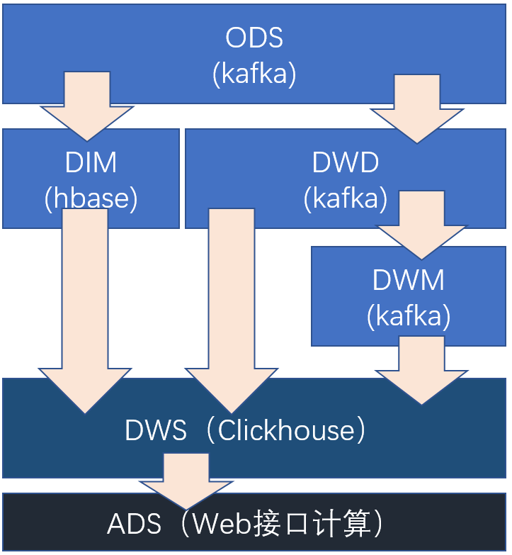
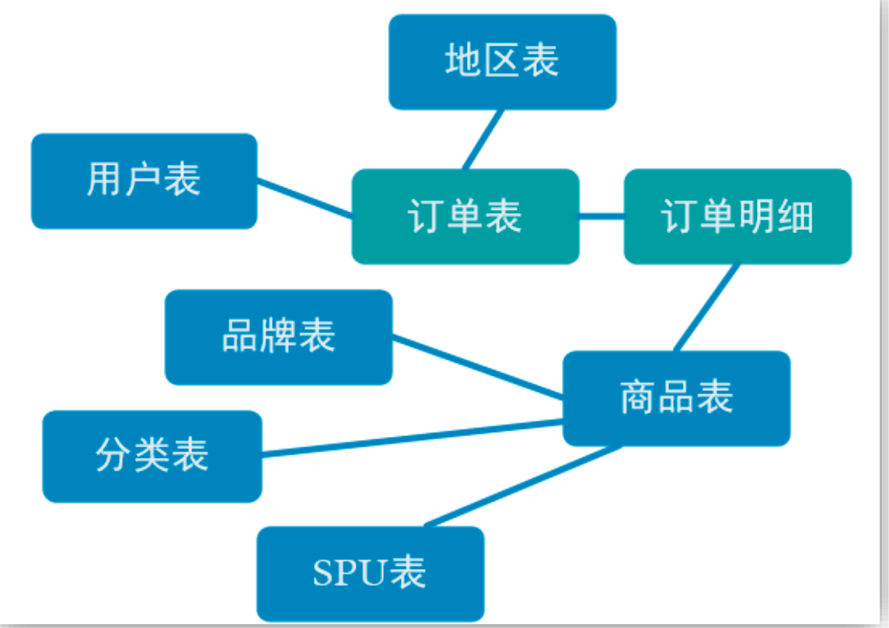
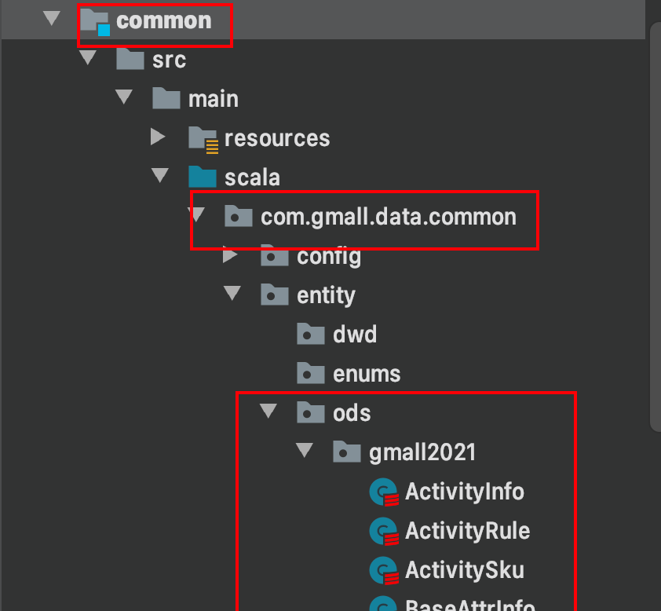
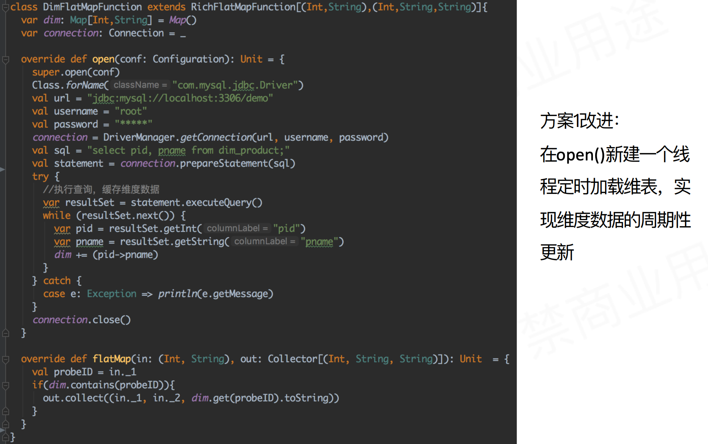
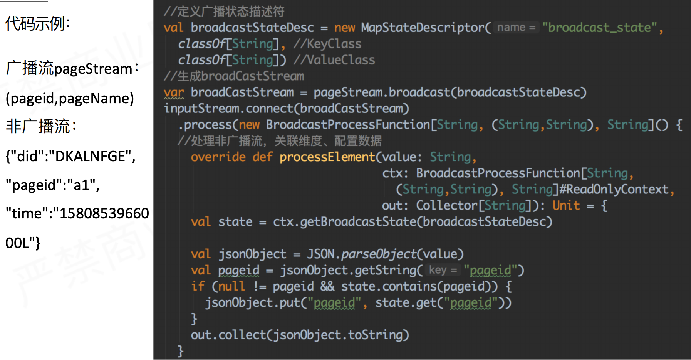
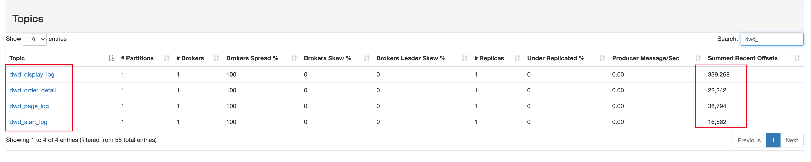

* [需求分析及实现思路](#需求分析及实现思路)
  * [分层需求分析](#分层需求分析)
  * [每层的职能](#每层的职能)
* [业务数据DWD层](#业务数据dwd层)
  * [需求分析与思路](#需求分析与思路)
  * [DIM层设计](#dim层设计)
    * [读取Kafka中Canal采集的binlog数据](#读取kafka中canal采集的binlog数据)
    * [维度数据写入HBase](#维度数据写入hbase)
      * [用户信息维度表](#用户信息维度表)
      * [商品：SPU维度表](#商品spu维度表)
      * [商品：SKU维度表](#商品sku维度表)
      * [地区维度表](#地区维度表)
      * [品牌维度表](#品牌维度表)
      * [类目维度表](#类目维度表)
  * [事实表与事实表关联](#事实表与事实表关联)
    * [订单表关联订单明细表](#订单表关联订单明细表)
      * [Interval Join](#interval-join)
      * [创建合并后的宽表实体类](#创建合并后的宽表实体类)
      * [代码实现](#代码实现)
    * [订单明细表关联优惠券表](#订单明细表关联优惠券表)
      * [coGroup](#cogroup)
      * [SessionWindow](#sessionwindow)
      * [代码实现](#代码实现-1)
  * [事实表与维度表关联](#事实表与维度表关联)
    * [维表Join的方案](#维表join的方案)
      * [<strong>方案一：将维表预加载到内存关联</strong>](#方案一将维表预加载到内存关联)
      * [方案二：预加载维表](#方案二预加载维表)
      * [方案三：热存储关联](#方案三热存储关联)
      * [方案四：广播维表](#方案四广播维表)
    * [异步IO](#异步io)
      * [异步IO API](#异步io-api)
      * [异步IO的重要参数](#异步io的重要参数)
    * [维表关联](#维表关联)
      * [代码实现](#代码实现-2)
  * [流量数据DWD层](#流量数据dwd层)
  * [数据埋点](#数据埋点)
  * [流量拆分](#流量拆分)
  * [流量分流输出](#流量分流输出)
* [总结](#总结)

#  需求分析及实现思路

## 分层需求分析

首先简单了解一下数仓的分层思路，实际上不管是离线数仓还是实时数仓，我们的分层与建模的思路是一致的。

**ODS层**

对于实时数仓来说，ods层一般是存储在kafka中的原始数据。所谓原始数据，主要有两个来源:

- 基于canal采集到kafka中的mysql表的binlog日志
- 基于flume/fluentd采集到kafka中的客户端访问日志
  - PC网页访问日志
  - H5端访问日志
  - 小程序访问日志
  - APP访问日志
- 后端网关服务日志

那么，对于ODS层的数据，我们需要做哪些处理呢？通常来说，什么都不做，ods层一般会保留数据原样，方便定位与回溯数据。

**DWD**

数据明细层，主要是对ODS层的数据做一定的清洗和主题汇总。

以用户访问日志表为例，在dwd层一般会做的事情:

- 保留和ODS层数据一样的数据维度
- 包含PC、H5、小程序、APP各个来源的数据
- 对部分枚举类型的值进行翻译
- 剔除异常数据，保证数据质量

一般在该层，还会做表之间的join、以及维表join冗余维度信息等。


在之前介绍实时数仓概念时讨论过，建设实时数仓的目的，主要是增加数据计算的复用

性，对数据以及服务之间进行解耦。每次新增加统计需求时，不至于从原始数据进行计算，而是从半成品继续加工而成。

我们这里从 kafka 的 ods 层读取用户行为日志以及业务数据，并进行简单处理，写回到kafka作为 dwd 层。



## 每层的职能

| 分层 | 数据描述                                               | 数据计算          | 存储       |
| ---- | ------------------------------------------------------ | ----------------- | ---------- |
| ODS  | 原始数据，日志和业务数据                               | 日志服务器，canal | kafka      |
| DWD  | 明细数据层，比如订单、页面访问等                       | flink             | Kafka      |
|      |                                                        |                   |            |
| DIM  | 维度数据                                               | flink             | HBase      |
| DWS  | 根据某个维度主题将多个事实数据轻度聚合，形成主题宽表。 | flink             | Clickhouse |
| ADS  | 基于dws数据实时指标计算                                | flink             | myql/HBase |
| OLAP | OLAP查询                                               | clickhouse        | clickhouse |


# 业务数据DWD层

##  需求分析与思路

订单是统计分析的重要的对象，围绕订单有很多的维度统计需求，比如用户、地区、商

品、品类、品牌等等。

为了之后统计计算更加方便，减少大表之间的关联，所以在实时计算过程中将围绕订单

的相关数据整合成为一张订单的宽表。

那究竟哪些数据需要和订单整合在一起？



如上图，在之前的工作中我们已经基于canal把mysql中的业务表都采集到了kafka中，每一个topic都对应一张mysql表。

下面应该做以下几方面:

- 维度表的存储
- 事实数据和事实数据关联，其实就是流与流之间的关联
-  事实数据与维度数据关联，其实就是流计算中查询外部数据源


## DIM层设计

首先应该将kafka中的维度表的信息同步到数据库中存储，维度表的设计应该考虑到维度的更新、查询数据的并发以及与业务库解耦等因素，一般会用HBase或Redis来作为实时数仓DIM层的存储。

- 对于维度变化缓慢且维度数据比较大的维度表，可以考虑用**HBase**存储，查询HBase时可以结合本地缓存 + 异步IO来实现。
- 对于维度变化较快且维表数据量相对较小的维度表，一般可以用**Redis**存储。

对于HBase维表以及Redis维表，我们考虑都实现一次。

### 读取Kafka中Canal采集的binlog数据

项目中设计了一个**`tools`**模块，该模块可以读取mysql中的表字段信息，将其映射成ODS层中Scala的类结构。执行主函数后会自动生成所有的类结构。



**canal-json**

Canal 为变更日志提供了统一的格式，基于canal采集的数据为一个json格式，数据格式如下。以activity_info表为例:

```json
{
    "data":[
        {
            "id":"1",
            "activity_name":"联想专场",
            "activity_type":"3101",
            "activity_desc":"联想满减",
            "start_time":"2020-10-21 18:49:12",
            "end_time":"2020-10-31 18:49:15",
            "create_time":null
        }
    ],
    "database":"gmall2021",
    "es":1617544188000,
    "id":15,
    "isDdl":false,
    "mysqlType":{
        "id":"bigint",
        "activity_name":"varchar(200)",
        "activity_type":"varchar(10)",
        "activity_desc":"varchar(2000)",
        "start_time":"datetime",
        "end_time":"datetime",
        "create_time":"datetime"
    },
    "old":null,
    "pkNames":[
        "id"
    ],
    "sql":"",
    "sqlType":{
        "id":-5,
        "activity_name":12,
        "activity_type":12,
        "activity_desc":12,
        "start_time":93,
        "end_time":93,
        "create_time":93
    },
    "table":"activity_info",
    "ts":1617545028537,
    "type":"INSERT"
}
```

**对**canal-json**格式数据的简单说明:**

- `isDdl` ，是否是ddl变更操作，比如create table/drop table]
- `sql` ，具体的ddl sql]
- `old`，表示数据行发生更改时，对那些字段做了更改以及上一级字段的值。若   "type":"INSERT"，则old为null，在某些情况下需要关心old的值来确定当前事实。
- `ts`，数据采集时间，可作为数据的事件时间。
- `    type`， INSERT/UPDATE/DELETE

对于kafka中的canal-json的数据，这里做了一个通用的模板，用于解析flatmessage数据映射为scala类。

```scala
class {ods_model_class_name} extends OdsModel {
  override var database: String            = _
  override var table   : String            = _
  override var ts      : Long              = _
  override var sqlType : ods.SqlType.Value = _
  override var old     : mutable.Map[String, String] = _
  {ods_model_fields}

  def this(database: String, table: String, sqlType: SqlType, ts: Long, old: mutable.Map[String, String]) {
    this()
    this.database = database
    this.table = table
    this.sqlType = sqlType
    this.ts = ts
    this.old = old
  }

  override def toString = s"{ods_model_to_string}"

}
```


### 维度数据写入HBase

需求:  将**用户**、**地区**、**品牌**、**商品**、**分类**、**SPU**维度表写入HBase。

#### 用户信息维度表

- **查询mysql中用户信息表结构**

  ```sql
  mysql> desc user_info;
  +--------------+--------------+------+-----+---------+----------------+
  | Field        | Type         | Null | Key | Default | Extra          |
  +--------------+--------------+------+-----+---------+----------------+
  | id           | bigint       | NO   | PRI | NULL    | auto_increment |
  | login_name   | varchar(200) | YES  |     | NULL    |                |
  | nick_name    | varchar(200) | YES  |     | NULL    |                |
  | passwd       | varchar(200) | YES  |     | NULL    |                |
  | name         | varchar(200) | YES  |     | NULL    |                |
  | phone_num    | varchar(200) | YES  |     | NULL    |                |
  | email        | varchar(200) | YES  |     | NULL    |                |
  | head_img     | varchar(200) | YES  |     | NULL    |                |
  | user_level   | varchar(200) | YES  |     | NULL    |                |
  | birthday     | date         | YES  |     | NULL    |                |
  | gender       | varchar(1)   | YES  |     | NULL    |                |
  | create_time  | datetime     | YES  |     | NULL    |                |
  | operate_time | datetime     | YES  |     | NULL    |                |
  | status       | varchar(200) | YES  |     | NULL    |                |
  +--------------+--------------+------+-----+---------+----------------+
  14 rows in set (0.01 sec)
  ```

  - 该用户信息表中包含了用户的一些基本信息，如用户名、密码、性别等信息，在制作用户维度表的时候，可以将这些字段全部存到HBase。事实上，某一张维度表的信息的来源往往可能是多张ODS表，这个时候，选用HBase作为实时数仓的DIM层存储介质的优势就体现出来了，它的列可以动态扩容，甚至可以基于rowkey设置多个列簇，将具有相同规律的列存放在同一个列簇下。开源Flink Sql也支持以时态表的方式读取HBase，选用HBase也是为Flink实时计算平台化做准备。

- **HBase创建表**

  ```shell
  create table 'dim:dim_user_info',NAME=>'f1'
  ```

  - 用户维度表以user_id作为rowkey，其余13列用户信息存在列簇f1下。
  - 对于用户信息的更新操作，一般只需要保留最新的用户信息就行了，所以HBase表的版本数设置为1(默认)，利用HBase的幂等性来实现用户维度表的更新。
  - 在使用HBase的时候，一定要注意表的rowkey以及预分区的设计，否则可能带来严重的数据热点问题，影响线上数据服务。本次测试中部署的HBase单节点，功能测试为主，不做预分区的设计。

- **写入数据到Hbase**

  - 对于**DataStream**所有的sink操作，可以设置一个Sink的基类，子类实现具体的流的sink实现。

    ```scala
    /**
     * sink接口，流sink函数需要继承该抽象类
     *
     * @tparam T
     */
    abstract class Sink[T] {
    
      // 请子类取一个有意义的方法名的方法来调用sink方法
      def sink(input: DataStream[T]): Unit = {
        doSink(input)
      }
    
      // 基于业务,封装在doSink方法中
      protected def doSink(input: DataStream[T]): Unit
    
    }
    ```

  - **RichSinkFunction代码实现**

    ```scala
    class UserInfoSinkFunc extends RichSinkFunction[UserInfo] {
    
        private var conn: Connection = _
        private var table: Table = _
    
        override def open(parameters: Configuration): Unit = {
          conn = HBaseUtil.getConn()
          table = conn.getTable(TableName.valueOf(Constants.DIM_USER_INFO))
        }
    
        override def invoke(input: UserInfo, context: SinkFunction.Context[_]): Unit =
          try {
            val put = new Put(Bytes.toBytes(input.id))
    
            // 添加要上传的列
            put.addColumn(Bytes.toBytes("f1"), Bytes.toBytes("login_name"), Bytes.toBytes(input.login_name))
            put.addColumn(Bytes.toBytes("f1"), Bytes.toBytes("nick_name"), Bytes.toBytes(input.nick_name))
            // 。。。
    
            table.put(put)
          } catch {
            case e: Exception => LoggerUtil.error(logger, e,
              s"failed to UserInfoSinkFunc.invoke,input=${input}")
          }
    
        override def close(): Unit = {
          if (table != null) table.close()
          if (conn != null) conn.close()
        }
      }
    ```

- **查看HBase中表数据**

  ```shell
  hbase(main):012:0> scan 'dim:dim_user_info',LIMIT=>1
  ROW                            COLUMN+CELL                                                                            
   1                             column=f1:birthday, timestamp=1618118849366, value=1985-11-23                          
   1                             column=f1:create_time, timestamp=1618118849366, value=2020-11-23 20:03:49              
   1                             column=f1:email, timestamp=1618118849366, value=cjn0s1flj@googlemail.com               
   1                             column=f1:gender, timestamp=1618118849366, value=F                                     
   1                             column=f1:login_name, timestamp=1618118849366, value=pbgkadgis99                       
   1                             column=f1:name, timestamp=1618118849366, value=\xE9\xA1\xBE\xE7\x91\x9E\xE5\x87\xA1    
   1                             column=f1:nick_name, timestamp=1618118849366, value=\xE5\x98\x89\xE5\x98\x89           
   1                             column=f1:phone_num, timestamp=1618118849366, value=13622353916                        
   1                             column=f1:user_level, timestamp=1618118849366, value=2                                 
  1 row(s)
  Took 0.0103 seconds 
  ```

  此时已经成功将用户信息维度表写入到HBase了，作为实时数仓的DIM层。

#### 商品：SPU维度表

#### 商品：SKU维度表

#### 地区维度表

#### 品牌维度表

#### 类目维度表

以上维度表写入HBase与dim_user_info类似，具体可以详见代码**`ods2dim`**模块：com.gmall.data.dim.App。维度数据都写入Hbase后，参考Hbase中的表:

```shell
hbase(main):012:0> list
TABLE                                                                                                                   
dim:dim_category3_info                                                                                                  
dim:dim_province_info                                                                                                   
dim:dim_sku_info                                                                                                        
dim:dim_spu_info                                                                                                        
dim:dim_trademark_info                                                                                                  
dim:dim_user_info       
```


## 事实表与事实表关联

**对于电商业务场景来说**，订单表一般会记录该订单的下单、支付等状态以及订单金额等信息，订单明细表则会记录该订单更加详细的信息，比如商品ID、品牌、类目等信息，一般来说，这两张表是具有业务上的事务性的，两张表数据的INSERT、UPDATE往往是相关联的。

对于离线数仓来说，往往会把业务表T+1同步到Hive中，在数仓中T+1的Join任务让两张表关联。而对于实时数仓来说，ODS层的数据在Kafka中，一般是使用Flink/Flink Sql消费Kafka中的数据实现双流Join的语义使得两张表关联，形成一张DWD层的事实宽表。

在flink中的双流join大体分为两种，一种是基于时间窗口的 join（Time Windowed Join），比如 join、coGroup 等。另一种是基于状态缓存的 join（Temporal Table Join），比如 intervalJoin。

关于如何基于DataStream Api实现双流Join，已经在其他文章中有详细说明了：[Streaming Joins](https://gitee.com/joeyooa/bigdata-project/blob/main/docs/flink/FlinkStreamingJoins.md)


### 订单表关联订单明细表

订单系统中，订单表和订单明细表是具有业务的事务性的，当下单时，订单表中会INSERT一条订单数据，对应的会异步插入订单明细数据到明细表中。订单表与订单明细表关联实现的是**Inner Join**语义，适合使用Interval Join来实现，Interval Join目前只支持事件时间语义。

#### Interval Join

```scala
import org.apache.flink.streaming.api.functions.co.ProcessJoinFunction;
import org.apache.flink.streaming.api.windowing.time.Time;

...

val orangeStream: DataStream[Integer] = ...
val greenStream: DataStream[Integer] = ...

orangeStream
    .keyBy(elem => /* select key */)
    .intervalJoin(greenStream.keyBy(elem => /* select key */))
    .between(Time.milliseconds(-2), Time.milliseconds(1))
    .process(new ProcessJoinFunction[Integer, Integer, String] {
        override def processElement(left: Integer, right: Integer, ctx: ProcessJoinFunction[Integer, Integer, String]#Context, out: Collector[String]): Unit = {
         out.collect(left + "," + right); 
        }
      });
    });
```

- Innerval Join的原理是连接两个keyedStream, 按照相同的key在一个相对数据时间的时间段内进行连接。
- between方法传递的两个参数lowerBound和upperBound，用来控制右边的流可以与哪个时间范围内的左边的流进行关联，即：leftElement.timestamp + lowerBound <= rightElement.timestamp <= leftElement.timestamp + upperBound 相当于左边的流可以晚到lowerBound（lowerBound为负的话）时间，也可以早到upperBound（upperBound为正的话）时间。
- 在使用中, between方法传递的两个参数lowerBound和upperBound并不是拍脑袋决定的。如果时间间隔设置过短，可能出现两条流Join不上的情况；如果时间间隔设置过长，则可能造成流任务存在比较大的状态而不能及时清理。参数的设置一般会参考业务含义、以及可以通过历史离线数据得到一个相对合理的时间间隔保证双流数据都可以Join到。

#### 创建合并后的宽表实体类

```scala
/**
 * 订单和订单明细关联宽表对应实体类
 * "id"相关的字段，在数仓中用string类型表示
 */
class DwdOrderDetail extends Model{

  override var ts: Long = _
  // 订单明细表
  var detail_id: String = _
  var order_id: String = _
  var sku_id: String = _
  var sku_name: String = _
  var sku_num: String = _
  var order_price: Double = _
  var source_type: String = _
  // 订单表
  var province_id: String = _
  var user_id: String = _
  var order_status: String = _
  var total_amount: Double = _
  var activity_reduce_amount: Double = _
  var coupon_reduce_amount: Double = _
  var original_total_amount: Double = _
  var feight_fee: Double = _
  // 明细表
  var split_total_amount: Double = _
  var split_activity_amount: Double = _
  var split_coupon_amount: Double = _
  // 订单表
  var create_time: String = _
  var operate_time: String = _
  var expire_time: String = _
  var create_date: String = _ // 把其他字段处理得到
  var create_hour: String = _

  // 查询维表得来: 地区
  var province_name: String = _
  var province_area_code: String = _
  var province_iso_code: String = _
  var province_3166_2_code: String = _

  // 用户
  var user_age: Int = _
  var user_gender: String = _

  // 商品: 查询sku维表
  var spu_id: String = _
  var tm_id: String = _ // 品牌id
  var category3_id: String = _

  // spu
  var spu_name: String = _
  // tm
  var tm_name: String = _
  // category
  var category3_name: String = _
  
}
```

#### 代码实现

**双流Join的基类**

```scala
/**
 * DataStream[T1] and DataStream[T2] to DataStream[T]
 * 双流join
 * @param source
 * @tparam T1
 * @tparam T2
 * @tparam T
 */
abstract class Merger[T1, T2, T](source: DataStream[T1]) extends Serializable {

  def joinStream(input: DataStream[T2]): DataStream[T] = {
    merge(source, input).name(s"merge_${getName}").uid(s"merger_${getUid}")
  }

  def getName: String
  
  def getUid: String

  protected def merge(input1: DataStream[T1], input2: DataStream[T2]): DataStream[T]

}
```

**子类实现**

```SCALA
 input1.keyBy(_.id)
      .intervalJoin(input2.keyBy(_.order_id))
      .between(Time.seconds(-5), Time.seconds(5))
      .process(new ProcessJoinFunction[OrderInfo, OrderDetail, DwdOrderDetail] {
        override def processElement(left: OrderInfo,
                                    right: OrderDetail,
                                    context: ProcessJoinFunction[OrderInfo, OrderDetail, DwdOrderDetail]#Context,
                                    out: Collector[DwdOrderDetail]): Unit =
          try {
            val orderDetail = DwdOrderDetail().from(left).from(right)
            out.collect(orderDetail)
          } catch {
            case e: Exception => LoggerUtil.error(OrderInfoAndDetailMerger.logger, e,
              s"failed to OrderInfoAndDetailMerger.merger,left=${left},right=${right}")
          }
      })
```


### 订单明细表关联优惠券表

用户下单支付的时候，往往还会领取相应的优惠券，订单系统会维护一张订单明细的Coupon表，也就是案例中的order_detail_coupon表，所以在订单明细事实宽表中，也需要冗余该订单的活动、优惠券的信息，方便事实数仓下游的统计分析等。

但不是每个订单都会领取优惠券参与活动，所以需要实现left join。那么，实现left join，需要选择什么方案呢？

在Flink中，实现双流join，前面已经介绍了基于时间间隔的interval join，并且interval join实现的是**inner join**的语义。除了interval join，Flink还提供了基于时间窗口的双流join。

```java
stream.join(otherStream)
    .where(<KeySelector>)
    .equalTo(<KeySelector>)
    .window(<WindowAssigner>)
    .apply(<JoinFunction>)
```

基于窗口的Join是将具有相同key并位于同一个窗口中的事件进行联结。值的一提的是，**join**算子也是实现的**inner join**，如果我们需要用到**coGroup**算子。

#### coGroup

该操作是将两个数据流/集合按照key进行group，然后将相同key的数据进行处理，但是它和join操作稍有区别，它在一个流/数据集中没有找到与另一个匹配的数据还是会输出。

coGroup的用法类似于Join，不同的是在apply中传入的是一个CoGroupFunction，而不是JoinFunction。

```
stream.coGroup(otherStream)
    .where(<KeySelector>)
    .equalTo(<KeySelector>)
    .window(<WindowAssigner>)
    .apply(<CoGroupFunction>)
```


#### SessionWindow

我们清楚需要使用**coGroup**算子来实现**left join**，那么应该选择哪种window保证具有相同key的在同一个窗口中进行联结呢？先简单介绍一下，基于滚动窗口的join，官方的描述:

**基于滚动窗口的join**

当执行滚动窗口联接时，所有具有公共键和公共滚动窗口的元素都按成对组合联接，并传递给a`JoinFunction`或`FlatJoinFunction`。因为它的行为就像一个内部联接，所以在其滚动窗口中不发出一个流中没有其他流元素的元素！


如图所示，我们定义了一个大小为2毫秒的翻滚窗口，该窗口的形式为`[0,1], [2,3], ...`。该图显示了每个窗口中所有元素的成对组合，这些元素将传递给`JoinFunction`。注意，在翻转窗口中`[6,7]`什么也不发射，因为在绿色流中不存在要与橙色元素⑥和joined连接的元素。

道理我们都懂，但不管是滚动窗口还是滑动窗口，都很难保证我们想要join的两条数据能够在一个窗口中。实时上，在订单系统中，需要join的两张事实表都是具有业务上的绑定的。比如，**订单优惠明细表会在支付订单的一段时间内写入到订单系统中**。

**基于SessionWindow的Join**

看一个实际场景：当我们需要分析用户的一段交互的行为事件时，通常的想法是将用户的事件流按照“session”来分组。session 是指一段持续活跃的期间，由活跃间隙分隔开。通俗一点说，消息之间的间隔小于超时阈值（`sessionGap`）的，则被分配到同一个窗口，间隔大于阈值的，则被分配到不同的窗口。

Flink的底层API中是实现了session window的，因此上面的场景，只要设置合理的`sessionGap`，是可以保证双流相同key的数据在一个窗口内的。


#### 代码实现

```scala
 input1.coGroup(input2)
      .where(_.detail_id)
      .equalTo(_.order_detail_id)
      .window(EventTimeSessionWindows.withGap(Time.seconds(5)))
      .apply(new CoGroupFunction[DwdOrderDetail, OrderDetailCoupon, DwdOrderDetail{
        override def coGroup(iterable: lang.Iterable[DwdOrderDetail],
                             iterable1: lang.Iterable[OrderDetailCoupon],
                             out: Collector[DwdOrderDetail]): Unit =
          try {
            val left = iterable.asScala.toSeq
            val right = iterable1.asScala.toSeq

            if (left.isEmpty)
              OrderDetailAndCouponMerger.logger.warn("DwdOrderDetail is empty")
            else {
              if (right.isEmpty) // 直接发出结果
                out.collect(left.head)
              else // 关联coupon信息
                out.collect(left.head.from(right.head))
            }
          } catch {
            case e: Exception => LoggerUtil.error(OrderDetailAndCouponMerger.logger, e,
              s"failed to OrderDetailAndCouponMerger.merger,left=${iterable},right=${iterable1}")
          }
      })
```

## 事实表与维度表关联

在实时数仓中，维度表一般是使用HBase或者Redis这两种数据库来作为存储介质的。这两种数据库，各有优缺点，一般是基于业务场景来决定。这里基于Flink流计算中的几种维表关联的方案:

### 维表Join的方案

#### **方案一：将维表预加载到内存关联**

- 实现方式

  - 定义一个类实现RichFlatMapFunction在open()方法中读取全部数据加载到内存中。在流上使用该算子，运行时与内存维度数据关联。

- 优点：实现简单

- 缺点:：因为存在内存中，所以仅支持小数据量维表；因为open方法中读取，所以维表变化需要重启作业。

- 代码示例:

  

#### 方案二：预加载维表

- 实现方式：
  - 通过Distributed Cache分发本地维度文件到task manager后加载到内存关联
  - 通过env.registerCachedFile注册文件
  - 实现RichFunction在open()方法中通过RuntimeContext获取cache文件
  - 解析使用文件数据
- 优缺点: 
  - 不需要外部数据库
  - 支持的数据量小，更新维表配置文件需要重启作业

#### 方案三：热存储关联

- 实现方式：

  - 实时流与热存储上维度数据关联，使用cache减轻存储访问压力
  - 将维度数据导入到热存储redis hbase es等，通过异步IO的方式查询，利用**cache机制**将维度数据缓存在内存。

- 优缺点:

  - 维度数据不受限与内存，支持较多维度数据
  - 维度更新结果可能有延迟，而且对外部存储的压力较大

- 试用场景：

  - 维度数据量较大，可接受维度更新有一定的延迟

  


#### 方案四：广播维表

- 实现方式

  - 利用broadcast State将维度数据流广播到下游做join
  - 将维度数据发送到kakfa作为广播原始流S1
  - 定义状态描述符MapStateDescriptor 调用S1.broadcast()获得broadCastStream S2
  - 调用非广播流S3.connect(S2),得到BroadcastConnectedStream S4
  - 应用混合流的S4.process()，并在KeyedBroadcastProcessFunction/BroadcastProcessFunction实现关联处理逻辑

- 优缺点:

  - 维度数据实时更新
  - 数据保存在内存中，支持维表数据量比较小。

  

一般来说，维度表数据都会维度在数据库中，方便维护和管理，当然在维度数据量很小的情况下也可以使用内存缓存或者广播维表的方式来实现，这里主要介绍方案三的实现。

### 异步IO

Async I/O 是阿里巴巴贡献给社区的一个呼声非常高的特性，于1.2版本引入。主要目的是为了解决与外部系统交互时网络延迟成为了系统瓶颈的问题。

相关flink异步IO的知识，请查看官网:[Flink异步IO](https://ci.apache.org/projects/flink/flink-docs-release-1.12/zh/dev/stream/operators/asyncio.html)

#### 异步IO API

Flink 的异步 I/O API 允许用户在流处理中使用异步请求客户端。API 处理与数据流的集成，同时还能处理好顺序、事件时间和容错等。

在具备异步数据库客户端的基础上，实现数据流转换操作与数据库的异步 I/O 交互需要以下三部分：

- 实现分发请求的 `AsyncFunction`
- 获取数据库交互的结果并发送给 `ResultFuture` 的 *回调* 函数
- 将异步 I/O 操作应用于 `DataStream` 作为 `DataStream` 的一次转换操作。

#### 异步IO的重要参数

```scala
  def unorderedWait[IN, OUT: TypeInformation](
      input: DataStream[IN],
      asyncFunction: AsyncFunction[IN, OUT],
      timeout: Long,
      timeUnit: TimeUnit,
      capacity: Int)
    : DataStream[OUT] = {
```

- **结果顺序**：unorderedWait/orderedWait：结果的有序和无序
- **Timeout**： 超时参数定义了异步请求发出多久后未得到响应即被认定为失败。 它可以防止一直等待得不到响应的请求。
- **Capacity**： 容量参数定义了可以同时进行的异步请求数。 即使异步 I/O 通常带来更高的吞吐量，执行异步 I/O 操作的算子仍然可能成为流处理的瓶颈。 限制并发请求的数量可以确保算子不会持续累积待处理的请求进而造成积压，而是在容量耗尽时触发反压。

### 维表关联

这里以关联用户维表为例，使用异步IO结合缓存的方式实现订单明细事实表关联用户维度表扩展宽表中的字段。一般来说，公司都会有一个统一的实时数仓维度表的存储框架，HBase和Redis比较常见。选用HBase或者Redis，是否使用异步IO关联并没有一个明确的标准。

- 当存储在Hbase中的维度表变化缓慢，且数据量较大时，我们对维度表的时效性不是特别高的时候，可以使用异步IO查询同时在本地内存中做**缓存**以提高查询性能。
- 当维度表数据比较小，且变化频繁，把维表数据存在Redis中，查询redis也是一种不错的方案。

**订单事实表与用户维度表关联**

#### 代码实现

```scala
/**
 * 订单明细表与用户维度表Join
 * @param input
 */
case class OrderDetailAndDimUserJoin(input: DataStream[DwdOrderDetail])
  extends Format[DwdOrderDetail] {
  override def getUid: String = "joinDimUser"

  override def getName: String = "joinDimUser"

  def joinDimUser(): DataStream[DwdOrderDetail] = super.format(input)

  override protected def doFormat(input: DataStream[DwdOrderDetail]): DataStream[DwdOrderDetail] = {
    /**
     * 几个重要的参数说明:
     * 1.unorderedWait/orderedWait：结果的有序和无序
     * 2.Timeout： 超时参数定义了异步请求发出多久后未得到响应即被认定为失败。 它可以防止一直等待得不到响应的请求。
     * Capacity： 容量参数定义了可以同时进行的异步请求数。
     */
    AsyncDataStream.unorderedWait(input, new OrderDetailAndDimUserJoinFunc, 20, TimeUnit.SECONDS, 10)
  }
}

object OrderDetailAndDimUserJoin {

  private val logger: Logger = LoggerFactory.getLogger(this.getClass)

  /**
   * guava cache用于将数据缓存到JVM内存中,简单、强大、及轻量级。
   * 它不需要配置文件，使用起来和ConcurrentHashMap一样简单，而且能覆盖绝大多数使用cache的场景需求！
   */
  var cache: Cache[String, DimUserInfo] = _
  var asyncConn: AsyncConnection = _
  var table: AsyncTable[AdvancedScanResultConsumer] = _

  class OrderDetailAndDimUserJoinFunc() extends RichAsyncFunction[DwdOrderDetail, DwdOrderDetail] {

    // 当前线程下，用于future回调的上下文环境
    implicit lazy val executor = ExecutionContext.fromExecutor(Executors.directExecutor())

    /**
     * 1. 初始化HBaseConnection、Table等，这里使用的是HBase2.0之后的异步客户端,实现与java库的CompletableFuture
     * 2. 缓存的初始化
     * @param parameters
     */
    override def open(parameters: Configuration): Unit = {
      cache = CacheBuilder.newBuilder()
        .expireAfterWrite(2, TimeUnit.HOURS) // 设置cache中的数据在写入之后的存活时间为2小时
        .maximumSize(10000) // 设置缓存大小为10000
        .build()

      asyncConn = HBaseUtil.getAsyncConn().get()
      table = asyncConn.getTable(TableName.valueOf(Constants.DIM_USER_INFO))
    }

    override def asyncInvoke(input: DwdOrderDetail, resultFuture: ResultFuture[DwdOrderDetail]): Unit =
      try {
        // 发送异步请求，接收 future 结果
        val resultFutureRequested: Future[DwdOrderDetail] = Future {
          var dimUser = new DimUserInfo
          // 先查询缓存中数据，若缓存不存在则查询HBase
          val dimUserInfo = cache.getIfPresent(input.user_id)

          if (Objects.isNull(dimUserInfo)) { // 查询HBase
            val get = new Get(Bytes.toBytes(input.user_id)).addFamily(Bytes.toBytes("f1"))

            val result = table.get(get)
            result.get().rawCells().foreach(cell => {
              val colName = Bytes.toString(CellUtil.cloneQualifier(cell))
              val value = Bytes.toString(CellUtil.cloneValue(cell))

              colName match {
                case "birthday" => dimUser.userBirthday = value
                case "gender" => dimUser.userGender = value
                case "login_name" => dimUser.userLoginName = value
                case _ => // do nothing
              }
            })
            // 将查询结果写入到缓存中
            cache.put(input.user_id, dimUser)
          } else
            dimUser = dimUserInfo

          // 结果输出
          input.from(dimUser)
        }

        /**
         * 客户端完成请求后要执行的回调函数,将结果发给future
         */
        resultFutureRequested.onSuccess {
          case result: DwdOrderDetail => resultFuture.complete(Iterable(result))
        }
      } catch {
        case e: Exception => LoggerUtil.error(logger, e,
          s"failed to joinDimUser,input=$input")
      }

    /**
     * 当异步 I/O 请求超时的时候，默认会抛出异常并重启作业。如果你想处理超时，可以重写 AsyncFunction#timeout 方法。
     * @param input
     * @param resultFuture
     */
    override def timeout(input: DwdOrderDetail, resultFuture: ResultFuture[DwdOrderDetail]): Unit =
      super.timeout(input, resultFuture)

    /**
     * 关闭连接
     */
    override def close(): Unit = {
      if (asyncConn != null) asyncConn.close()
    }
  }

}
```

另外几张维度表的实现方式和以上类似，就不一一实现了，实际上我们考虑到了真实的线上数据情况，选择了一种比较复杂的实现方式。

**以上，一张订单交易域的DWD事实宽表事实宽表就已经做好了，它包含了订单相关的明细数据，以及冗余了用户、商品、地区、品牌等维度的维度信息，然后将数据以**json**格式写入到Kafka中，作为实时数仓的DWD层。**

## 流量数据DWD层

我们前面采集的日志数据已经保存到Kafka中，作为日志数据的 ODS 层，从 kafka 的ODS 层读取的日志数据分为 3 类, 页面日志、启动日志和曝光日志。这三类数据虽然都是用户行为数据，但是有着完全不一样的数据结构，所以要拆分处理。将拆分后的不同的日志写回 Kafka 不同主题中，作为日志 DWD 层。

页面日志输出到主流，启动日志输出到启动侧输出流，曝光日志输出到曝光侧输出流。

**ODS层中的流量数据格式**

```json
{
    "actions":[
        {
            "action_id":"get_coupon",
            "item":"13",
            "item_type":"coupon_id",
            "ts":1618669254443
        }
    ],
    "common":{
        "ar":"110000",
        "ba":"Xiaomi",
        "ch":"xiaomi",
        "is_new":"1",
        "md":"Xiaomi 10 Pro ",
        "mid":"mid_71",
        "os":"Android 11.0",
        "uid":"48",
        "vc":"v2.1.134"
    },
    "displays":[
        {
            "display_type":"promotion",
            "item":"90",
            "item_type":"sku_id",
            "order":1,
            "pos_id":3
        },
        {
            "display_type":"query",
            "item":"10",
            "item_type":"sku_id",
            "order":2,
            "pos_id":3
        },
        {
            "display_type":"promotion",
            "item":"89",
            "item_type":"sku_id",
            "order":3,
            "pos_id":3
        },
        {
            "display_type":"query",
            "item":"91",
            "item_type":"sku_id",
            "order":4,
            "pos_id":4
        },
        {
            "display_type":"promotion",
            "item":"35",
            "item_type":"sku_id",
            "order":5,
            "pos_id":5
        },
        {
            "display_type":"promotion",
            "item":"61",
            "item_type":"sku_id",
            "order":6,
            "pos_id":4
        },
        {
            "display_type":"query",
            "item":"5",
            "item_type":"sku_id",
            "order":7,
            "pos_id":2
        }
    ],
    "page":{
        "during_time":16887,
        "item":"35",
        "item_type":"sku_id",
        "last_page_id":"login",
        "page_id":"good_detail",
        "source_type":"recommend"
    },
    "ts":1618669246000
}
```

**主要任务**

- **数据拆分**

  根据日志数据内容,将日志数据分为 3 类, 页面日志、启动日志和曝光日志。

  - 启动日志:  原始数据中包含`start`属性
  - 曝光数据: 原始数据中包含`display`属性，每次上报的数据可能有多次曝光，需要做flatMap
  - 页面数据

- **将不同流的数据推送下游的 kafka 的不同 Topic 中**

## 数据埋点

[一文读懂产品埋点](https://mp.weixin.qq.com/s/7ayENVBguxxmYDtoG5t5ww)

[关于曝光埋点，你知多少](https://mp.weixin.qq.com/s/efsdC6Xpn2p51m0aLmGH7g)

[你应该掌握的产品数据指标](https://mp.weixin.qq.com/s/Vw9vCyR9VYVKsJjNxvstpw)

## 流量拆分

**代码实现**: **`com.gmall.data.dwd.FlowTopology`**

```scala
input.process(new ProcessFunction[OdsBaseLog, DwdBaseLog] {
      override def processElement(input: OdsBaseLog,
                                  context: ProcessFunction[OdsBaseLog, DwdBaseLog]#Context,
                                  out: Collector[DwdBaseLog]): Unit =
        try {
          if (input.start != null) { // 启动日志
            val dwdStartLog = GsonUtil.gson.fromJson(input.common, classOf[DwdStartLog])
            out.collect(dwdStartLog.from(input.start).from(input.ts))
          } else { // 非启动日志,则为页面日志或者曝光日志(携带页面信息)
            if (input.displays != null) { //曝光日志，做flatMap
              val dwdDisplayLog = GsonUtil.gson.fromJson(input.common, classOf[DwdDisplayLog])
              for (elem <- input.displays.asScala) {
                out.collect(dwdDisplayLog.from(input.ts).from(elem).from(input.page))
              }
            } else { // 页面访问日志
              val dwdPageLog = GsonUtil.gson.fromJson(input.common, classOf[DwdPageLog])
              out.collect(dwdPageLog.from(input.page).from(input.ts))
            }
          }
        } catch {
          case e: Exception => LoggerUtil.error(OdsBaseLogConvert.logger, e,
            s"failed to OdsBaseLogConvert.doConvert,input=${input}")
        }
    })
```

## 流量分流输出



# 总结

- 读取Kafka的Change log数据

- DIM维度层
  - HBase
  - Redis
- DWD层
  - 事实表关联：双流Join
  - 维度表关联：Cache + 异步IO
- 以上都可以使用Flink sql（在搭建好实时计算平台之后）

