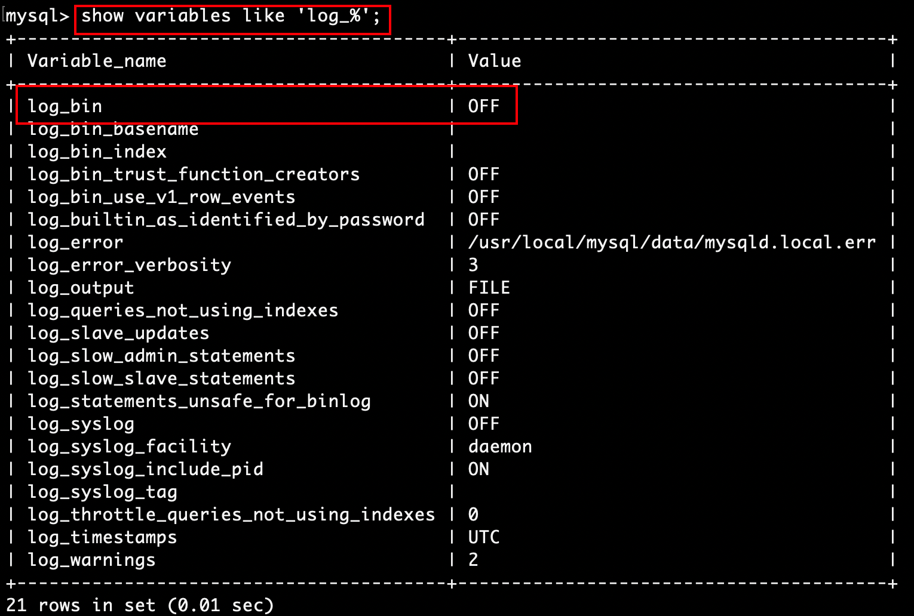
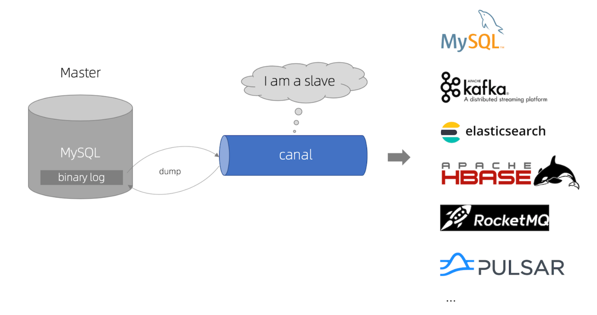

# Mysql的Binlog原理

在实时数仓业务数据采集、分析中，往往是通过采集Mysql数据库的Binlog到消息队列中进行实时分析。首先，我们介绍一下什么是Mysql的Binlog。

## 二进制日志(binlog)

MySQL的二进制日志可以说MySQL最重要的日志了，它记录了所有的 DDL 和DML(除了数据查询语句)语句，以事件形式记录，还包含语句所执行的消耗的时间，MySQL的二进制日志是事务安全型的。

的二进制日志是事务安全型的。

- binlog是记录所有**数据库表结构变更**（例如CREATE、ALTER TABLE…）以及**表数据修改**（INSERT、UPDATE、DELETE…）的二进制日志。

- **binlog不会记录SELECT和SHOW**这类操作，因为这类操作对数据本身并没有修改，但你可以通过查询通用日志来查看MySQL执行过的所有语句。

- 二进制日志包括两类文件：
  - `二进制日志索引文件`（文件名后缀为.index）用于记录所有的二进制文件
  - `二进制日志文件`（文件名后缀为.00000*）记录数据库所有的DDL和DML(除了数据查询语句)语句事件。


一般来说，开启二进制日志会有1%的性能损耗，二进制有两个最重要的使用场景: 

- 其一：MySQL Replication 在 Master 端开启 binlog，Master 把它的二进制日志

  传递给 slaves 来达到 master-slave 数据一致的目的。

- 其二：自然就是数据恢复了，通过使用 mysqlbinlog 工具来使恢复数据。

## binlog的开启

- 登录Mysql后使用下面的命令查看是否开启binlog

  ```sql
  show variables like 'log_%';
  ```

- 如果看到以下日志说明没有开启binlog

  

- 编辑配置文件

  ```shell
  vim /etc/my.cnf
  ```

- 配置文件中增加以下内容

  ```shell
  [mysqld]
  log-bin=mysql-bin # 开启 binlog
  binlog-format=ROW # 选择 ROW 模式
  server_id=1 # 配置 MySQL replaction 需要定义，不要和 canal 的 slaveId 重复
  ```

- 重启mysql后查看`show variables like 'log_%';`

  ```shell
  mysql> show variables like 'log_%';
  +----------------------------------------+----------------------------------------+
  | Variable_name                          | Value                                  |
  +----------------------------------------+----------------------------------------+
  | log_bin                                | ON                                     |
  | log_bin_basename                       | /usr/local/mysql/data/mysql-bin        |
  | log_bin_index                          | /usr/local/mysql/data/mysql-bin.index  |
  | log_bin_trust_function_creators        | OFF                                    |
  | log_bin_use_v1_row_events              | OFF                                    |
  | log_error                              | /usr/local/mysql/data/mysqld.local.err |
  ```

- 授权 canal 链接 MySQL 账号具有作为 MySQL slave 的权限,

  ```sql
  CREATE USER canal IDENTIFIED BY 'canal';  
  GRANT SELECT, REPLICATION SLAVE, REPLICATION CLIENT ON *.* TO 'canal'@'%';
  -- GRANT ALL PRIVILEGES ON *.* TO 'canal'@'%' ;
  FLUSH PRIVILEGES;
  ```

- 查看配置是否成功

  ```sql
  show master status;
  ```

  如果打印以下内容，则说明配置成功

  ```shell
  mysql> show master status;
  +------------------+----------+--------------+------------------+-------------------+
  | File             | Position | Binlog_Do_DB | Binlog_Ignore_DB | Executed_Gtid_Set |
  +------------------+----------+--------------+------------------+-------------------+
  | mysql-bin.000002 |      885 |              |                  |                   |
  +------------------+----------+--------------+------------------+-------------------+
  1 row in set (0.00 sec)
  ```


### binlog配置的说明

mysql binlog 的格式有三种，分别是 `STATEMENT,MIXED,ROW`。

在配置文件中可以选择配置 

```shell
binlog_format= statement|mixed|row
```

- **statement**：语句级，binlog 会记录每次一执行写操作的语句,相对 row 模式节省空间，但是可能产生不一致性，比`·update tt set create_date=now() `如果用 binlog 日志进行恢复，由于执行时间不同可能产生的数据就不同。优点是节省空间缺点则是，有可能造成数据不一致。
- **row**：行级， binlog 会记录每次操作后每行记录的变化。优点是保持数据的绝对一致性，因为不管 sql 是什么，引用了什么函数，他只记录执行后的效果。缺点则是会占用较大空间。
- **mixed**：statement 的升级版，一定程度上解决了，因为一些情况而造成的 statement 模式不一致问题，默认还是statement，在某些情况下譬如：当函数中包含 UUID() 时；包含 AUTO_INCREMENT 字段的表被更新时；执行 INSERT DELAYED 语句时；用 UDF 时；都会按照 ROW 的方式进行处理
- 生产环境开启binlog提供实时分析能力，一般采用**row**模式


# Canal

## canal简介

实时数据分析中常常有实时分析处理MySQL中的增量数据的需求，面对这种需求当然我们可以通过JDBC的方式定时查询Mysql，然后再对查询到的数据进行处理也能得到预期的结果，但是Mysql往往还有其他业务也在使用，这些业务往往比较重要，通过JDBC方式频繁查询会对Mysql造成大量无形的压力，甚至可能会影响正常业务的使用，在基本不影响其他Mysql正常使用的情况下完成对增量数据的处理，那就需要 Canal 了。

当前目前社区有很多采集数据库中增量数据的工具，比如Debezium、Canal、Maxwell，Flink社区也专门开发了专门的connector format，的鉴于目前社区的活跃度，我们暂重点调研canal。

Canal [kə'næl] 是阿里巴巴开源的纯java开发的基于数据库binlog的增量订阅&消费组件。Canal的原理是模拟为一个Mysql slave的交互协议，伪装自己为MySQL slave，向Mysql Master发送dump协议，然后Mysql master接收到这个请求后将binary log推送给slave(也就是Canal)，Canal解析binary log对象(原始为 byte 流)。

**当前的 canal 支持源端 MySQL 版本包括 5.1.x , 5.5.x , 5.6.x , 5.7.x , 8.0.x**



## canal安装

关于canal等组件的安装，为了方便快速测试，我们暂时在mac/linux文件系统下直接安装，后期再用docker-compose打包安装。

---

Canal的server mode在1.1.x版本支持的有TPC、Kafka、RocketMQ。本次安装的canal版本为1.1.4，Canal版本最后在1.1.4之后，并且canal在1.1.4版本引入了canal-admin工程，支持面向WebUI的canal管理能力。server端采用MQ模式，MQ选用Kafka。服务器系统为Centos7，其他环境为：jdk8、Scala 2.11、Mysql、Zookeeper、Kafka。

### mysql环境准备

在此之前我们已经安装好了mysql并开启了binlog，并且授予了canal具有MySQL slave的权限。

### 下载canal

- 访问Canal的Release页 canal v1.1.2 

  ```shell
  wget https://github.com/alibaba/canal/releases/download/canal-1.1.4/canal.deployer-1.1.4.tar.gz
  ```

- 解压缩

  ```shell
  mkdir /opt/module/canal
  tar zxvf canal.deployer-1.1.4.tar.gz -C /opt/module/canal
  ```

  - 解压完成后，进入 /tmp/canal 目录，可以看到如下结构

    ```shell
    drwxr-xr-x   6 root  wheel   192 Apr  1 22:52 bin/
    drwxr-xr-x   8 root  wheel   256 Apr  1 22:52 conf/
    drwxr-xr-x  83 root  wheel  2656 Apr  1 22:52 lib/
    drwxrwxrwx   2 root  wheel    64 Sep  2  2019 logs/
    ```

- 


