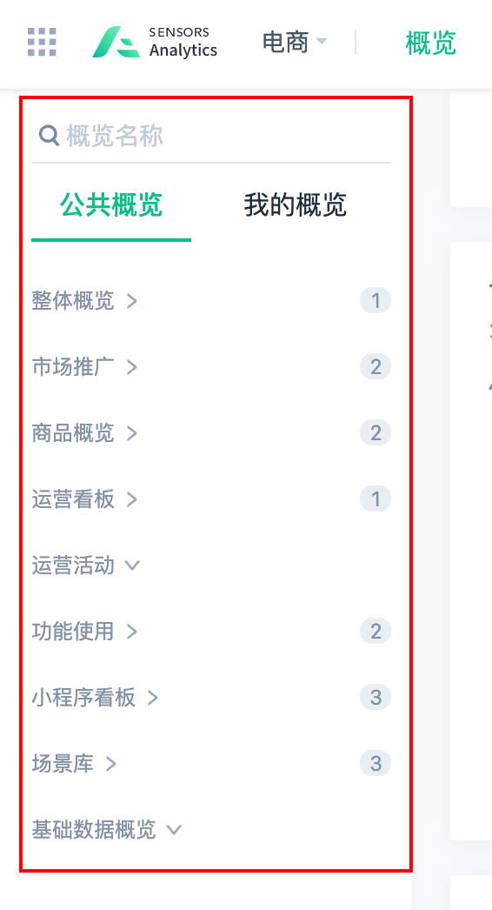
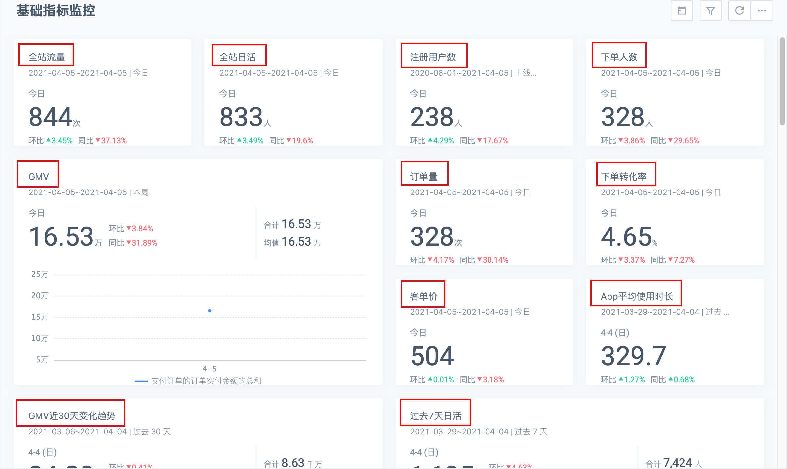
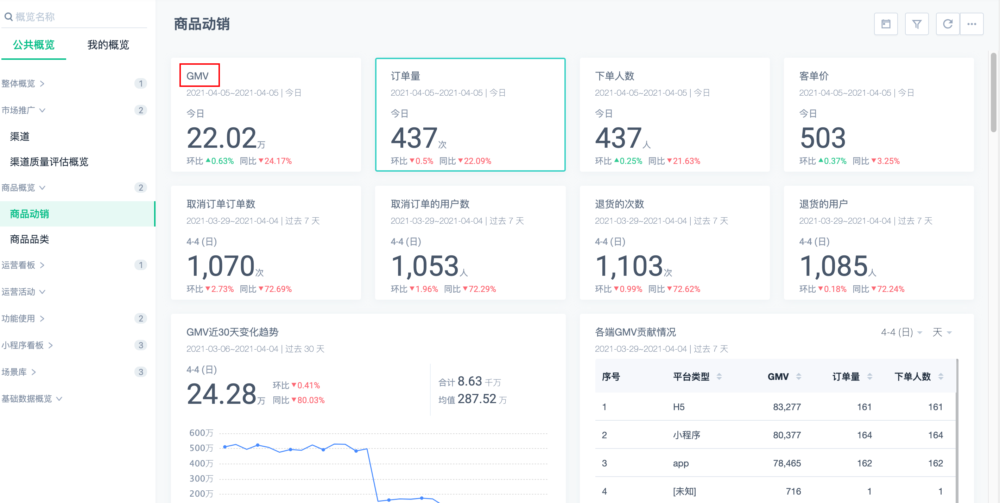
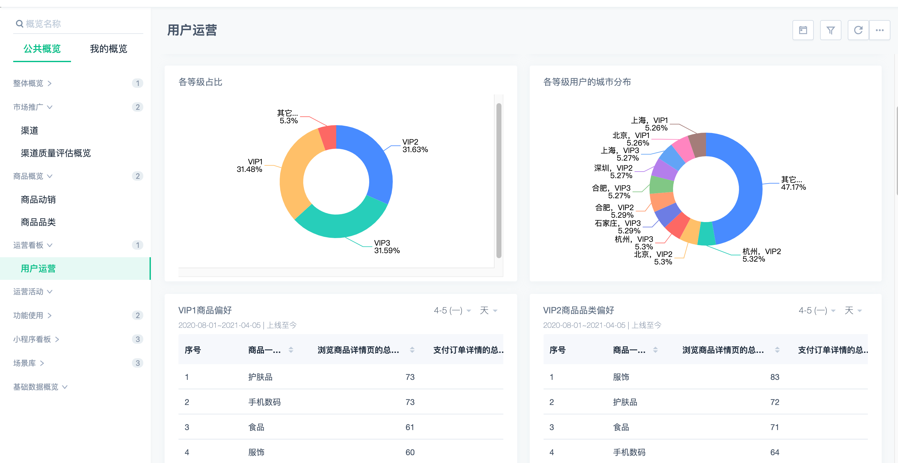
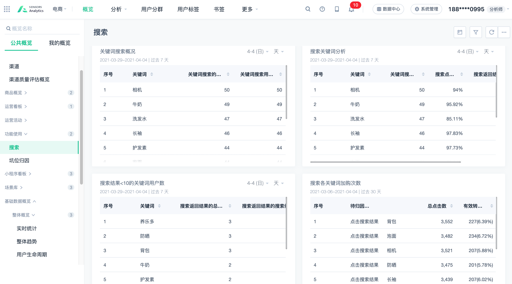
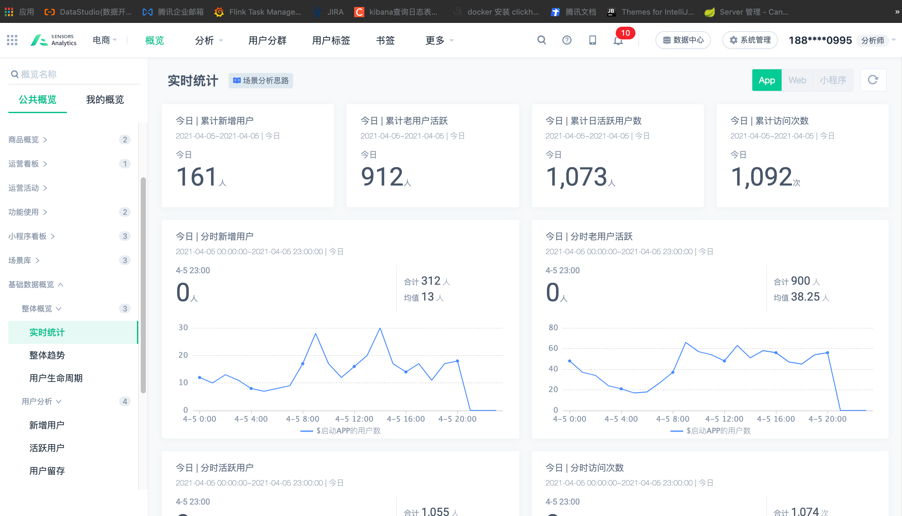
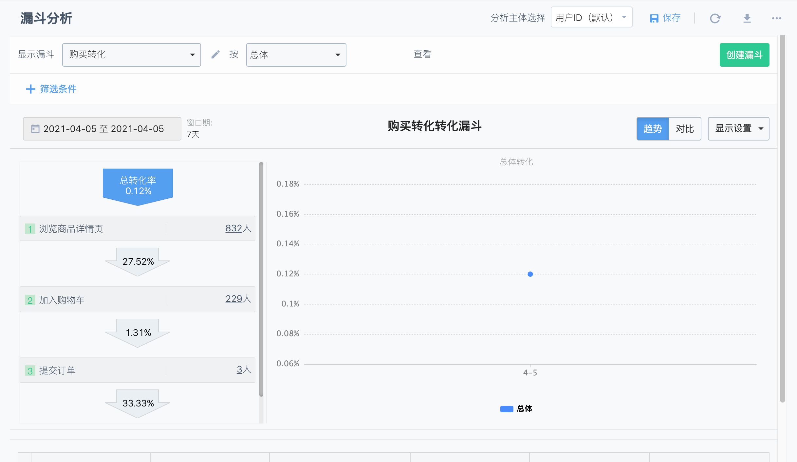
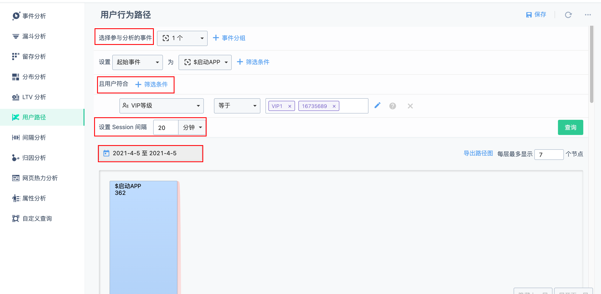
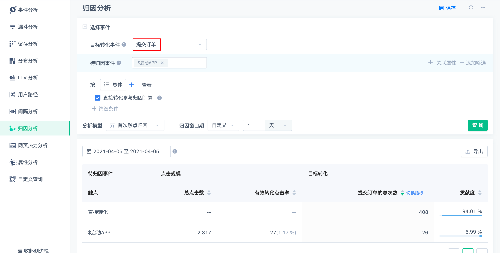

# 产品需求

首先需要了解一个互联网公司有哪些常见的数据需求，在公司发展前期，往往是基于需求来驱动数据平台的发展的。这里我们以一个电商互联网为例，借鉴神策数据平台体验demo，了解数据需求。

# 数据概览

也就是通常说的数据大屏，一般来说，大屏包含了一些基础的指标数据。

## 整体概览

这里列举了几个基础的指标，包括实时指标与离线指标。

## 商品概览

## 运营看板

## 功能看板

## 实时统计

# 数据分析

一般是一些OLAP的分析，能够支持用户自定义的维度以及度量值做灵活查询。

## 漏斗分析

这里就有一个典型的漏斗分析的OLAP需求，是需要实时数仓的支持的。

## 留存分析

## 用户路径

## 归因分析

这里就有一个很典型的订单归因分析，比如我们想实时的知道一个用户从打开APP开始到提交订单的转化贡献数据。

# 用户画像

**TODO**

# 总结

- 互联网公司的一些实时数据需求。