> 编辑导语：如今早已经进入了大数据时代，现在的数据指标体系对于促进产品和业务增长是至关重要的；在实际操作中，需要根据相应的数据分析和业务需求进行相应的构建；本文是作者分享了关于如何从0到1构建指标体系的方法，我们一起来看一下。

假设豆豆在小区附近开了一家小型超市，花花每周二下班后，都会来店里买半斤猪头肉，风雨无阻，从不间断。

豆豆心想：“花花每次来的时间都很固定，并且已经坚持了好几个月，我如果提前把肉准备好，这样就可以节省彼此的时间了。”此后每周二，只要花花一到店里，豆豆就跟他说，“猪头肉已经调好啦，还特意为你多加了花生碎，直接拎走就行”。

花花笑了，心里想：“嘿，这服务员挺贴心的，不错嘛”。在上面案例中，豆豆通过对花花 “每周二下班后买猪头肉” 行为的观察，提前“调好多加花生碎的猪头肉”。

豆豆的这种做法不仅刷新了顾客的好感度，还提升了用户的忠诚度；豆豆观察花花的行为在互联网行业中叫做数据分析，要做好数据分析，并将数据分析应用于业务中，首先就需要构建好指标体系。

接下来，笔者就会聊聊如何构建指标体系。

## 一、数据指标体系

### 1. 什么是数据指标体系？

通常我们讲述的指标是对当前业务有参考价值的统计数据，换句话说，不是所有的数据都叫指标；指标的核心意义是它使得业务目标可描述、可度量、可拆解；常用的指标有PV、UV等。

指标可分为原子指标和派生指标，按照笔者的理解，原子指标就是不加任何修饰词的指标，又叫度量，例如订单量、用户量、支付金额等；衍生/派生指标就是在原子指标上进行加减乘除或者修饰词的限定等等。

派生指标是对原子指标业务统计范围的圈定，例如：昨日境外输入病例、网站近一周的访问量等。

衍生指标是基于原子指标组合构建的，例如：客单价 = 支付金额 / 买家数。

指标体系是从不同维度梳理业务，并将零散单点的具有相互联系的指标，系统化地组织起来；其中，维度分为定性维度和定量维度，定性维度主要是文字描述类，例如姓名、地名等；定量维度主要是数值描述类，如工资、年龄等。

举个某电商限时秒杀的栗子（如下图）：

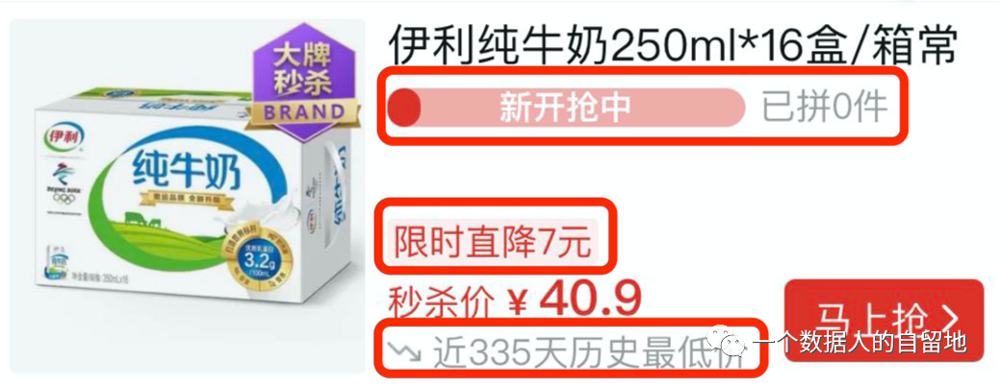

上方红框代表市场活跃度，中间红框代表当前价格波动幅度，下方红框代表价格趋势；三个红框中的指标，可以构成一个最简单的指标体系，用来描述伊利纯牛奶秒杀的现状，属于描述指标体系。

总的来说，指标体系是对业务指标体系化的汇总，主要用来明确指标的维度、口径、指标取数逻辑等信息，并能够迅速获得指标的相关信息。

### 2. 为什么需要指标体系？

对于数据产品经理来说，搭建指标体系可以更好地梳理业务，提高问题分析效率。

因此，笔者认为指标体系的主要目的为：

- 给业务发展提供指引；
- 建立共同愿景，凝聚团队，激励团队。

## 二、如何设计指标体系？

下面分五部分（如下图），讲一讲如何设计指标体系：

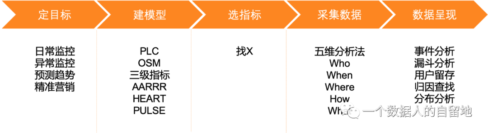

### 1. 定目标

这是第一步，也是最重要的一步，同时也是很多产品上线运营后进行评估的标准，并以此形成闭环。

好的目标具有以下三个特征：

- 与高层目标一致；
- 目标应当符合 SMART 原则；
- 具有挑战性。

下面笔者就先说说 SMART 原则：

1）S 代表具体（Specific）

目标必须是明确的、具体的，要对标特定的工作指标，不能笼统。

下面举个栗子：

- 无效的目标：我要成为一名内容运营；
- 具体的目标：我要掌握文案技巧。

2）M 代表可衡量（Measurable）

目标必须是可衡量的，可衡量的指标是数量化或者行为化的，验证这些指标的数据或者信息是可以获取的。

上面的栗子进一步细化，让目标可衡量。

可衡量的目标：我要掌握文章设主题、切痛点、找创意、定标题等技巧。

3）A 代表可实现（Attainable）

目标必须是可实现的，具体指在付出努力的情况下可以实现，避免设立过高或过低的目标。

假如笔者刚接触内容运营，定下了 “我要在两个月内成为写文案的专家” 这个目标，那么这就是一个不切实际的目标。

较接地气的目标是：我要在三个月内掌握文章设主题、切痛点、找创意、定标题等技巧。

4）R 代表相关性（Relevant）

目标是与工作中的其它目标相关联。

比如我的中期目标是：一年内能够独立完成文章的一系列创作与发布，我的短期目标就是：三个月内掌握文章基本创作技巧。

只有中期目标与短期目标具有很强的相关性，那么中期目标才更容易实现。

5）T 代表有时限（Time-bound）

目标的时限性就是指目标是有时间限制的，比如我在运营公众号时给自己定的目标是 “截止到 2021 年 12 月 31 日创作并发布 12 篇文章”，这里的 2021 年 12 月 31 日就是确定的时间限制。

### 2. 建模型

1）PLC 模型

产品生命周期（Product Life Cycle），简称 PLC，指产品的市场寿命，即一种产品从开始进入市场到被市场淘汰的整个过程；产品的生命周期有探索期、成长期、成熟期、衰退期（如下图）。

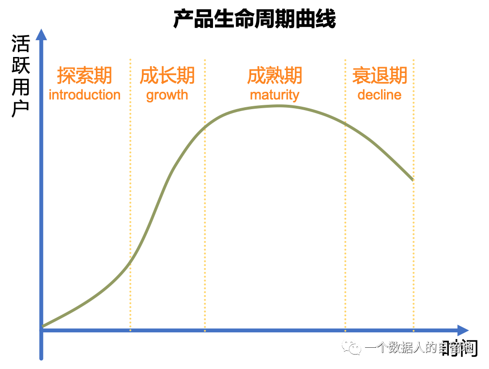

在产品不同的生命周期阶段，各业务方侧重点不同，关注的数据指标亦有所不同。

探索期：

探索期的重点在于验证产品的核心价值，是否能够满足市场需求并从中获利；要做到：假设、验证、迭代、执行。这个阶段会着重关注目标用户画像、关键行为、留存率。下面以早期的土巴兔为例（如下图）。

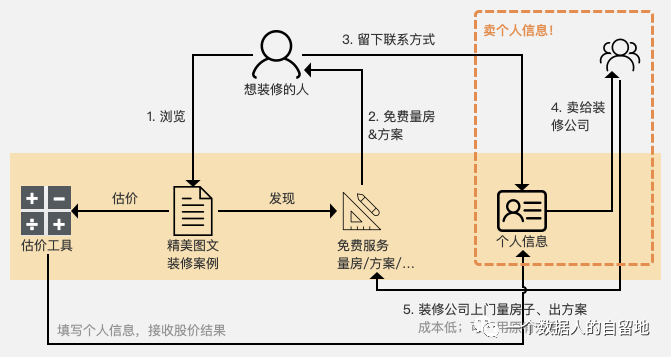

根据上图对土巴兔业务流程的梳理，以及对土巴兔的定位（为探索期），因此当前主要关注点是打磨服务能力，了解用户群体的需求与产品服务的匹配度，重点关注的指标如下：

- 目标用户画像：性别、年龄、学历、地域、职业；
- 关键行为：图文发表量、浏览人数、传播量、使用量；
- 质量：文章转化率、完成率。

成长期：

经过了打磨产品的探索期，产品有了较好的留存率，这时候产品开始进入用户增长期；处于成长期时，需要将注意力放在用户的整个生命周期的前半段上，即提高留存、用户激活、自传播。

成熟期：

随着市场趋于饱和，用户的增速放缓，逐渐趋于稳定，关注的核心指标应该是用户活跃度，同时关注商业转化路径；实际上如果市场本身是增量市场，可以考虑通过获客，把一个成熟期的产品做出一个不一样的增长曲线。

衰退期：

新产品或替代品出现，用户转向其他产品，导致原产品用户量迅速下降，从而使原来的销售额和利润迅速下降，于是产品就进入衰退期；处于衰退期，需要重点关注用户流失与维系。

2）OSM 模型

OSM 模型（Objective，Strategy，Measurement）是指标体系建设过程中辅助确定核心的重要方法，包含业务目标、业务策略、业务度量，是指标内容横向的思考。

业务目标：

主要从用户视角和业务视角确定目标，原则是切实可行、易理解、可干预、正向有益。

- 用户使用产品的目标是什么？
- 产品满足了用户的什么需求？
- 公司/业务/产品等存在的目的是什么？

业务策略：

为了达成上述目标采取的策略。换句话说，用户在什么时候感受到诉求被满足？

业务度量：

这些策略随之带来的数据指标变化有哪些？是否有效满足了用户的诉求，达成了业务目标。

以 PMCAFF 为例，按照 OSM 模型，它的指标是什么样？

① 业务目标：用户来使用 PMCAFF 这个产品，目标是什么？

需要涉及两类用户：内容生产者和内容消费者，接下来简单介绍内容生产者的分析思路。

用户需求：发布文章或分享观点，建立行业影响力或者内容受到反馈。

那么，如何让用户感受到自己的需求被满足了呢？

② 业务策略

③ 业务度量

接下来，我们需要针对这些策略去做指标，在这里我们的指标分别是结果指标和过程指标。

备注：

- 结果指标：用来反映某些业务产出或结果的指标项，通常是延后知道的，很难进行干预；结果指标通常更多的是监控数据是否异常，或者监控某个场景下用户的需求是否被满足。
- 过程指标：用户在做某个操作的时候所产生的指标，可以通过某些策略来影响过程指标，从而影响结果指标，过程指标通常更加关注用户的需求为什么被满足或没有被满足。

指标选取之后，就是选择分析维度了，而维度选择层面主要是通过数据分析视角结合实际业务场景来确定；例如：用户标签维度、时间维度、渠道维度等。

3）指标分级

指标分级主要是将指标化解为不同层级并逐级分析。根据企业战略、企业组织及业务进行自上而下的分级，对指标进行层层剖析，其中可结合 OSM 模型来确定指标。

一级指标：公司战略层

用于衡量公司整体目标完成情况，与公司当前业务紧密结合，并对所有员工均有核心的指导意义。一级指标通常指引着公司的战略。

一级指标通常根据市场、产品生命周期、产品品类和商业模式确定，一个时间点只有一个最关键的指标（OMTM，One Metric That Matters）。

例如：小红书的OMTM（又称：北极星指标）如何演变？

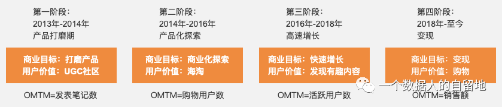

二级指标：业务策略层

为达成战略目标，公司会对其进一步拆解为业务线或事业群的核心指标；通常为了实现一级指标，企业会做出相应的策略，二级指标也会与这些策略有所关联。

例如：小红书当前的一级指标是销售额，那么二级指标可以设定为不同品类商品的销售额，分地区的销售额等；这样当一级指标出现问题的时候，我们可以快速定位问题所在。

三级指标：业务执行层

三级指标是将二级指标纵向展开，进行路径拆解、漏斗拆解、公式拆解；三级指标通常用于定位二级指标的问题，通常指导一线运营或分析人员开展工作，三级指标是业务中最多的指标。

路径拆解需要对业务流程进行分析，例如：打开应用、浏览首页、浏览商品详情页、加入购物车、提交订单、订单支付、支付成功。

运用公式拆解月活跃用户，如下图。

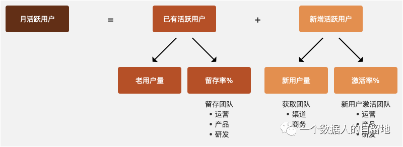

4）AARRR

AARRR 模型就是海盗模型，也是用户分析的经典模型。它反映了增长贯穿于用户生命周期的各个阶段，即获取（Acquisition）、激活（Activation）、留存（Retention）、变现（Revenue）、自传播（Referral）。

获取：

运营人员通过各种渠道进行推广，以各种手段获取目标用户，评估各种营销渠道效果，并不断调整运营策略，以不断降低获客成本。

关键指标：曝光量、点击、下载、安装、激活、安装率、激活率、注册转化率、留存率、付费率等。

激活：

激活指目标用户开始使用产品。产品经理通过新手奖励、产品引导等方式，来引导用户使用产品核心功能；我们需要掌握用户的行为数据，监控产品健康程度。

关键指标：新老用户占比、DAU/WAU/MAU、日均登录次数、日均使用时长等。

留存：

通常维护一个老用户的成本要远远低于获取一个新用户的成本，所以不仅要拉新用户，还需要关注用户粘性，以及关注用户在哪里流失、为什么流失。

关键指标：新用户留存率、老用户留存率、活跃用户留存率、日周月留存率、流失率等。

变现：

主要用来衡量产品的商业价值，这也是商业的本质。

关键指标：ARPU、ARPPU、付费率（区分新老用户）、客单价、LTV 等。

自传播：

主要是基于产品、营销、明星等事件的吸引力，从而使用户自发地传播。

关键指标：裂变系数等。

## 三、埋点

数据采集，就是采集相应的数据，是数据流的起点，采集的对不对、全不全，直接决定数据的质量，影响后续的所有环节。

那么采集什么样的数据才算是质量高？这就需要提前规划埋点。

### 1. 什么是埋点

埋点是（用户行为）数据采集领域的术语。它的学名叫做事件追踪（Event Tracking）；它主要是针对特定用户行为或事件进行捕获、处理和发生的相关技术及其实施过程，如用户点击某个按钮的次数、阅读某篇文章的时长等等。

埋点是一种常用的数据采集方法，它是为了满足丰富的数据应用而做的用户行为过程及结果记录。

埋点是数据采集的一种重要方法，并且是数据的起源，采集的数据常常用于分析产品的使用情况、用户行为偏好等，于是延伸出用户画像、用户推荐系统等数据产品。

### 2. 埋点流程

业务部门根据业务提出需求，产品经理将需求整理为数据需求，并输出数据需求文档（DRD，Data Requirements Document）。

接下来，产品经理就跟数据团队进行需求评审，评审通过与否，会后都要给相关人员发送需求评审纪要邮件；评审通过之后，产品经理需要跟开发工程师确定开发时间，并发送排期邮件。

开发完成后，测试工程师、数据分析师、产品经理需要验证埋点是否完整且准确，提交验收报告；功能上线后，产品经理或开发工程师需要发送上线邮件。如下图：

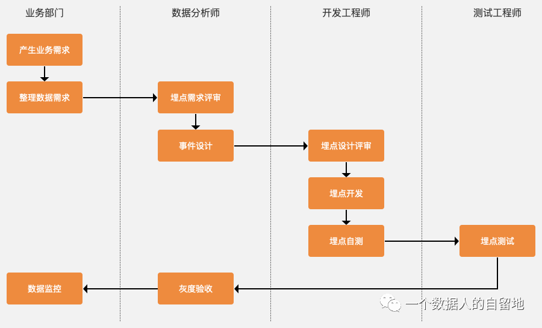

### 3. 如何埋点

怎么埋呢？从业务角度出发，划分五个角度：

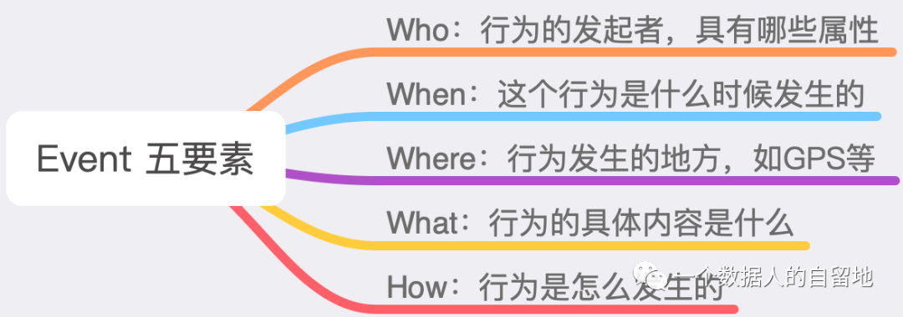

Who：对行为的发起者进行标识，一般使用账号或设备号进行标识。账号是常用的方式，通过身份证号、手机号、账号 ID 等信息区分用户；设备号多用于不需要登录的产品，通过设备的编码来区分用户。

When：记录行为是什么时候发生的，一般使用服务器时间，即 Unix 时间戳记录行为发生时间；它是全球统一时间，不受地区的干扰。

Where：记录行为发生的地点，一般通过 GPS 进行定位，或者通过设备 IP 判断用户位置。

What：指用户行为的具体内容是什么，比如用户阅读一本书，那么购买的书名是什么？价格是多少？哪个出版社出版等信息。

How：行为是怎么发生的，一般包含在行为名称中，如提交某订单，也有若干行为是可以通过多种方式完成，如解锁 iPhone，可以输入密码解锁，也可以刷脸解锁，无论使用哪种方式都是一种可以记录的信息。

### 4. 案例：浏览APP首页行为埋点

针对浏览某电商 APP 首页行为，从五个角度分析，分为特有指标和公共指标两类，如下图：

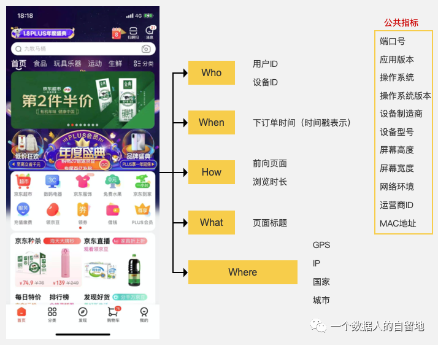

### 5. 案例：支付订单行为埋点

针对支付订单行为，从五个角度分析，分为特有指标和公共指标两类，如下图。

## 四、数据分析

### 1. 什么是数据分析？

数据分析是指用适当的统计、分析方法对收集来的大量数据进行分析，提取有用信息和形成结论，并对数据加以详细研究和概括总结的过程；简单地说，就是对数据进行分析。

数据分析的目的是把隐藏在一些看似杂乱无章的数据背后的信息挖掘出来，提炼出目标对象的内在规律。对于企业来说，数据分析的本质在于创造商业价值，驱动企业业务增长。

### 2. 数据分析方法

我们以一个电商网站为例，用数据产品对该网站进行数据采集，然后使用常见的数据分析方法分析，如漏斗分析、留存分析、时间分析、用户画像、渠道分析、分布分析等方法。

1）漏斗分析

漏斗分析能够科学反映用户行为状态，以及从起点到终点各业务流程的用户转化率情况，是一种重要的流程式数据分析模型；漏斗分析模型已经广泛应用于用户行为分析中，例如渠道质量评估、产品销售等日常数据运营与数据分析工作中。

比如：对于电商产品来说，最终目的是让用户购买商品，但整个流程的转化率由每一步的转化率综合而定；这时，我们就可以通过漏斗分析模型进行监测。

如下图所示，我们可以观察用户在每一个层级上的转化率，寻找转化路径的薄弱点，优化产品，提升用户体验，最终提升整体的转化率。

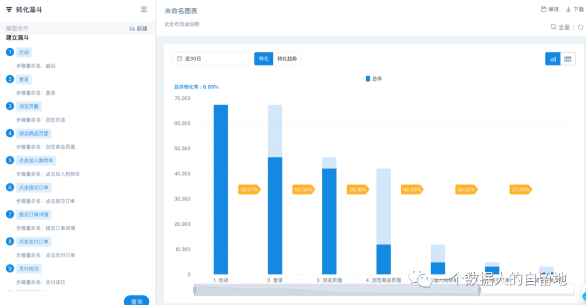

2）留存分析

留存分析是一种用来分析用户参与情况/活跃程度的分析模型，即由初期的新用户转化为活跃用户、忠诚用户的过程；随着统计数字的变化，相关人员可看到不同阶段的用户变化情况，从而判断产品对用户的粘性。

比如：对某电商平台来说，用户最近 30 日的 7 日留存率（如下图），从图中得知，用户留存率较低；接下来，按照地区、年龄、行为等，将用户分为不同的群体，观察留存的区别，找到产品可优化点。

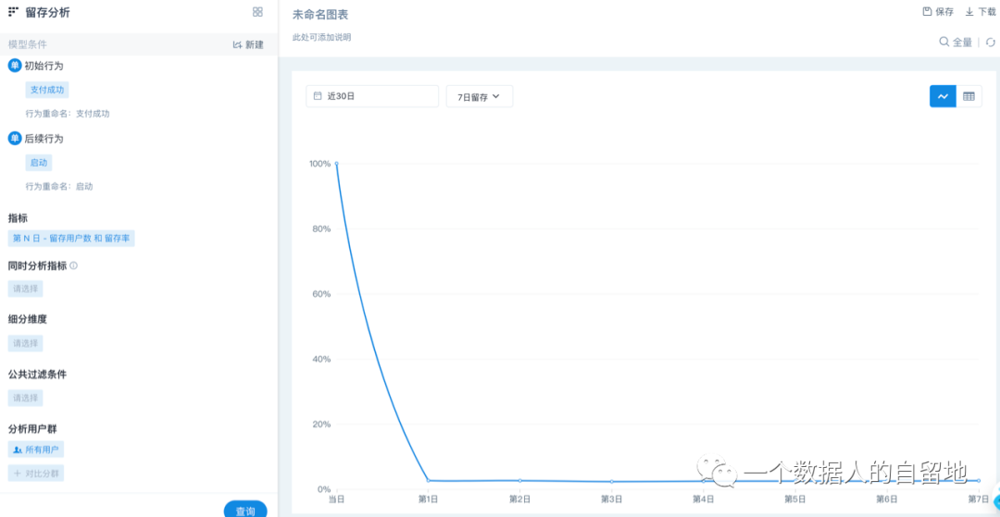

3）事件分析

事件分析用来研究某事件的发生对企业的影响以及影响的程度。通常来说，事件分析包括事件定义与选择、下钻分析、结果等环节。

事件，是一个用户在某个时间点、某个地方、以某种方式完成了某个具体的事情，它的关键因素包括 Who、When、Where、What、How。

比如：运营人员发现过去 30 日支付成功次数波动较大（如下图）；这时企业可以先定义事件，通过筛选条件配送方式为 “自营”，再从其他多个维度细分下钻，如 “订单金额”、“是否使用优惠券”、“商品ID”等；当进行细分筛选时，异常数据无处遁形。

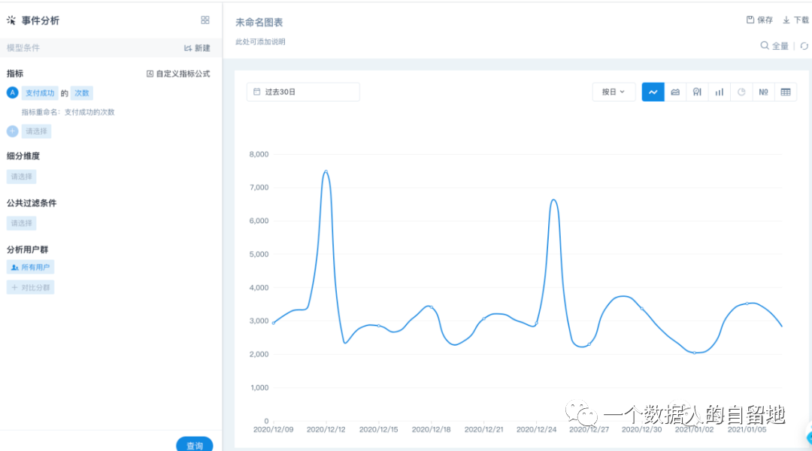

4）渠道分析

渠道，是指产品与用户发生互动的各个接触点，比如 SEO、SEM、社交媒体等等。

渠道分析主要用于分析用户的访问来源及访问深度，通过访问用户数、访问次数、停留时长等指标来评估渠道质量，同时也通过转化率来衡量渠道转化的效果。

一个完整的渠道流程，常常包括：站外渠道 ->展示广告->着陆页->访问着陆页的转化文案->激活用户->产品转化 六大关键环节，每个环节都有相应的指标来衡量。

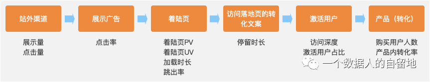

① 用户在站外渠道，包括 SEO、SEM、社交媒体等，看到各种宣传广告。

关键指标：展示量、点击量、CTR（Click Through Rate，点击率）。

② 有兴趣的用户点击 URL 链接进入着陆页。

关键指标：着陆页 PV、着陆页 UV、加载时长、跳出率等。

③ 对产品或服务感兴趣的用户下载、注册或者试用产品或服务，这个过程通常称之为激活。

关键指标：停留时长、访问深度等。

④ 用户激活后，点击 CTA（Call To Action，召唤用户行为）选择商品加入购物车并提交、支付，这就是一个完整的购买流程。

关键指标：购买用户人数、产品内转化率等。

以上是四种常用的数据分析方法，在不同行业中，它们常常以不同的样式展示出来。

当我们面对不同的问题时，需要清楚地知道哪个或哪几个方法最为有效，需要结合具体场景灵活运用，没有最好的分析方法只有最适合的。