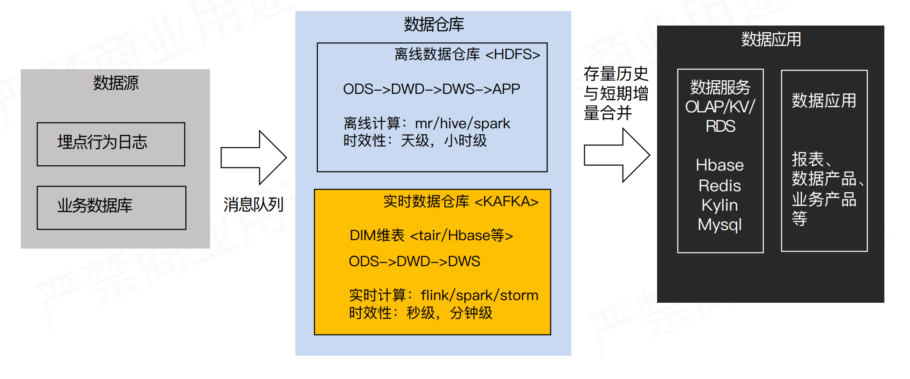

# 实时数仓概述

## 实时数仓产生背景

我们先来回顾一下数据仓库的概念。

**数据仓库：**

**数据仓库是一个面向主题的（Subject Oriented）、集成的（Integrate）、相对稳定的（Non-Volatile）、反映历史变化（Time Variant）的数据集合，用于支持管理决策。**

**建模方法：**

- 范式建模
- 维度建模

在互联网大数据场景下，用的最多的是维度建模方法。

然后先看一下离线数仓的经典架构。如下图：

这个数仓架构主要是偏向互联网大数据的场景方案，由上图可以看出有三个核心环节。

1. 第一个环节是**`数据源部分`**，一般互联网公司的数据源主要有两类：

   - 第 1 类是通过在客户端埋点上报，收集用户的`行为日志`，以及一些后端日志的日志类型数据源。对于埋点行为日志来说，一般会经过一个这样的流程，首先数据会上报到 Nginx 然后经过 Flume 收集，然后存储到 Kafka 这样的消息队列，然后再由实时或者离线的一些拉取的任务，拉取到我们的离线数据仓库 HDFS。

2. - 第 2 类数据源是`业务数据`库，而对于业务数据库的话，一般会经过 Canal 收集它的 binlog，然后也是收集到消息队列中，最终再由 Camus 拉取到 HDFS。

3. 这两部分数据源最终都会落地到 HDFS 中的 ODS 层，也叫贴源数据层，这层数据和原始数据源是保持一致的。

4. 第二个环节是**`离线数据仓库`**，是图中蓝色的框展示的部分。可以看到它是一个分层的结构，其中的模型设计是依据维度建模思路。

5. - 最底层是 ODS 层，这一层将数据保持无信息损失的存放在 HDFS，基本保持原始的日志数据不变。
   - 在 ODS 层之上，一般会进行统一的数据清洗、归一，就得到了 DWD 明细数据层。这一层也包含统一的维度数据。
   - 然后基于 DWD 明细数据层，我们会按照一些分析场景、分析实体等去组织我们的数据，组织成一些分主题的汇总数据层 DWS。
   - 在 DWS 之上，我们会面向应用场景去做一些更贴近应用的 APP 应用数据层，这些数据应该是高度汇总的，并且能够直接导入到我们的应用服务去使用。

6. 在中间的离线数据仓库的生产环节，一般都是采用一些离线生产的架构引擎，比如说 MapReduce、Hive、Spark 等等，数据一般是存在 HDFS 上。

7. 经过前两个环节后，我们的一些应用层的数据会存储到数据服务里，比如说 HBase 、Redis、Kylin 这样的一些 KV 的存储。并且会针对存在这些数据存储上的一些数据，封装对应的服务接口，对外提供服务。在最外层我们会去产出一些面向业务的报表、面向分析的数据产品，以及会支持线上的一些业务产品等等。这一层的话，称之为更贴近业务端的数据应用部分。

以上是一个基本的离线数仓经典架构的介绍。

大家都了解到现在随着移动设备的普及，我们逐渐由制造业时代过渡到了互联网时代。在制造业的时代，传统的数仓，主要是为了去支持以前的一些传统行业的企业的业务决策者、管理者，去做一些业务决策。那个时代的业务决策周期是比较长的，同时当时的数据量较小，Oracle、DB2 这一类数据库就已经足够存了。

但随着分布式计算技术的发展、智能化技术发展、以及整体算力的提升、互联网的发展等等因素，我们现在在互联网上收集的数据量，已经呈指数级的增长。并且业务不再只依赖人做决策，做决策的主体很大部分已转变为计算机算法，比如一些智能推荐场景等等。所以这个时候决策的周期，就由原来的天级要求提升到秒级，决策时间是非常短的。在场景上的话，也会面对更多的需要实时数据处理的场景，例如实时的个性化推荐、广告的场景、甚至一些传统企业已经开始实时监控加工的产品是否有质量问题，以及金融行业重度依赖的反作弊等等。因此在这样的一个背景下，实时数仓就必须被提出来了。

## 实时数仓架构

首先跟大家介绍一下实时数仓经典架构 - Lambda 架构：

###  Lambda 架构

