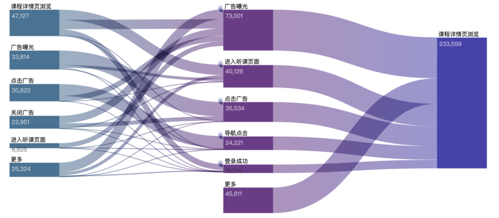

​	主要是用户在使用web端网页、App、小程序的过程中,与客户端产品交互过程中产生的数据,比如页面浏览、点击、停留、评论、点赞、收藏等。用户行为数据测采集往往涉及到前端埋点技术，关于如何埋点，这里不做过多介绍，主要介绍从产品/数据开发/数据分析的角度介绍什么是用户行为数据以及用户行为数据的价值。

## 什么是用户行为数据

用户使用产品，是通过一系列与产品的交互行为来完成的，且每一次的交互都有特定的操作对象，比如浏览某个商品详情、点击提交订单按钮、输入搜索词、滑动视频等。通过这些交互行为，用户完成对产品的使用并进一步转化。

将用户在产品中的交互行为及交互对象转化为可以存储的数据形式，我们便得到了用户行为数据。

## 用户行为数据的价值

用户行为数据记录了用户在产品中进行的操作，以及具体的操作对象，反映了用户如何使用产品。在日常工作中，通过对行为数据进行分析，可应用于以下几个方面：

- **评估功能的效果**
-  **协助分析问题**
- **了解用户行为路径**
- **用户分群**

### 评估功能的效果

功能上线后，需要对功能的效果进行评估。比如，功能触达了多少用户、有多少用户使用等。用户行为数据，作为记录并量化用户如何使用产品的一种形式，可以用来评估功能效果。

注：这里的功能，泛指对产品进行的任何尝试，而不仅是需要开发的代码功能。比如，为了提升商品详情页下单率，尝试新的介绍文案，也看作为一个“功能”。

用户在产品中，可以进行多种操作，不同的操作，代表了用户不同的想法。最常见的操作行为有：浏览、点击。

**浏览：**指用户在产品中对某个具体内容进行了“阅读”。发生了浏览行为，表示用户已经看到了某个内容。比如，我们收集到某个用户浏览了某个商品详情页，那我们就可以认为，该商品，已经被这个用户看见了。可以用来评估内容的曝光量是否达到预期。

比如，为增加产品曝光，选定了3个渠道推广产品落地页，预期通过10天的推广，为产品带来10000次的曝光。推广结束后，需要了解是否达到了预期。通过对各个渠道的落地页浏览量进行统计：渠道A的浏览量为5000，B的浏览量为3000，C的浏览量为4000，则可以得出，曝光量达到了预期。

**点击：**指使用鼠标/手指触控了某个位置，是用户对产品的主动触发，多发生在浏览行为之后。产品中很多关键行为都需要用户通过点击完成，比如从列表进入详情页、提交订单、播放视频、打开/关闭广告等；点击行为因为是用户主动触发的操作，可以用来评估用户对所浏览的内容是否感兴趣。

比如：在内容列表中，展示给用户两种不同的新闻：娱乐新闻和汽车类新闻，用户浏览了列表100次，假设在列表中两种新闻的标题等都一样好，但用户浏览列表时，点击了80次娱乐新闻，20次汽车新闻，则可以一定程度的认为，相比汽车新闻，该用户更喜欢娱乐新闻。

### 协助分析问题

工作中，经常面临分析产品中存在的某个问题的场景。通常，给出的是一个具体的问题，需要我们找到原因。

如果只有一个问题，是很难定位原因的，因为我们所知道的信息量太少。用户行为数据，在用户以及用户所产生的行为的纬度上，丰富了我们的信息量，使得我们掌握了更多的信息，可以使用这些数据，对一个很“大”的问题进行拆分，将问题的范围不断缩小。

> 比如：小明新做了一个老带新的活动，希望通过邀请得好礼，刺激老用户将活动链接分享给他人，为产品带来新注册用户。
>
> 活动流程为：老用户购课后弹出活动弹窗>>点击弹窗进入活动页面>>生成专属海报>>保存并分享给好友>>好友注册。
>
> 老带新作为一个越来越重要的获客手段，领导对此十分重视，但功能上线了一周，效果却平平，只带来了100个新用户。领导要求小明尽快查出原因。
>
> 如果只有100位新用户这个数据，很难定位问题原因，我们需要更加丰富的用户行为数据，对问题进行拆解。
>
> 根据活动流程，用户参与活动，需要进行几个关键的行为：浏览弹窗>>点击弹窗>>生成专属海报>>保存海报>>分享邀请好友
>
> 假设流程中，有2000名用户浏览弹窗，500人点击弹窗，300人生成了专属海报，260人点击保存图片。
>
> 通过这些数据，可以很容易发现，用户浏览弹窗到点击弹窗这一步，流失最为严重。可以针对这一步进行一些假设，并设计解决方案。

### 了解用户行为路径

用户从某一点开始，到某一点结束，其操作对象，所构成的路线，称为用户行为路径。比如，用户从搜索开始，到完成购买，操作对象有：点击搜索框>>浏览搜索列表>>浏览详情>>提交订单>>完成支付，则这条路线是该用户从搜索开始，到完成购买的行为路径。

用户行为路径通常使用桑基图进行展示，便于更直观的观察。如图：

 

注：图片为在网络上查找，非真实路径与数据。

设计产品时，按照产品期待的方向，会自然的形成一条路径，但用户实际使用中，并不会完全按照期待的路径操作。了解用户行为路径，能够知道用户实际使用与产品设想的差异点，针对性优化产品。

> 如：期待的用户购买路径是，浏览列表页>>浏览详情页>>生成订单>>完成支付，但实际发现，浏览详情页到生成订单这一步转化率很低，用户在该环节流失严重，可以借助用户行为路径，查看用户浏览详情后，又进行了什么操作，流向了哪里，定位具体的流失原因。
>
> 我们以浏览详情页为路径起点发现，浏览详情后，用户主要有两条路径：一部分用户返回了列表页；另一部分用户点击评价后，返回列表页。针对这两种主要的流失路径，可以对用户操作时的心理活动进行探索，如详情文案不够吸引人、评价不够好等，在接下来针对性的优化。

### 用户分群

用户分群，是指将满足相同特征条件的用户组成一个群组。比如，产品有三个获客渠道A、B、C，可以将用户按照渠道来源的纬度，分为三个群组。通过用户分群，可以对不同的群体针对性的运营与分析，促进用户转化。

通过用户行为对用户分群是一种常见的分群方法。用户行为数据信息量丰富，能够从多纬度对用户进行细致的分群，提高用户分群运营的效果。常使用的行为分群维度有：

**1.是否发生过某个/些行为及次数**

这种用户分群以用户是否发生过某个/些行为为条件，对用户进行分群，常使用产品所关注的具体行为对用户进行分群，并进行后续分析等。

比如，假设一款在线教育产品，通过尝试发现，新用户如果听完了赠送的体验课，则购买正价课的意愿相比其他新用户会高很多，因此，需要提高新用户体验课的完课率。可以通过新用户是否听完体验课这个行为，筛选出没听完体验课的群体，针对性的进行运营，提高这部分用户的完课率，常见的如推送push、发送短信等。

**2.发生某个/些行为的频率是否有变化**

这种用户分群以用户发生某个/些行为上的频率是否有变化，对用户接下来的行为进行预测，进而划分出群体，针对性运营。

比如，一款健身产品，使用用户以往月均锻炼次数及本月锻炼次数的比值，来预测用户流失的可能性，假设将用户本月锻炼次数与月均锻炼次数的比值小于40%，定义为可能流失用户，则可以使用这个条件，划分出可能流失的用户，针对性的挽留。

## 用户行为数据采集

这里不去关注埋点体系，只是造一定的用户埋点数据，用于demo分析，借助于神策提供的电商行业demo，在分析：自定义查询中下单一定的数据量，然后生产到kafka中，作为实时数仓ODS层。

> 代码详见: collections模块com.gmall.data.collection.flow.Csv2JsonDemo03

神策提供的demo中，提供了一些常见的埋点事件，下面只列举几个：

| 事件名            | 事件显示名   |
| :---------------- | :----------- |
| ProductExposure   | 商品曝光     |
| SubmitOrder       | 提交订单     |
| PayOrder          | 支付订单     |
| AddToShoppingCart | 加入购物车   |
| $MPShare          | 小程序分享   |
| $AppViewScreen    | App 浏览页面 |
| $AppClick         | App 元素点击 |
| Collect           | 收藏商品     |

**神策埋点数据结构**

```json
{
	"distinct_id": "123456",
	"time": 1434556935000,
	"type": "track",
	"event": "ViewProduct",
	"project": "ebiz_test",
	"time_free": true, //建议在导入历史数据时使用，SDK 采集的实时数据不建议使用
	"properties": {
		"$is_login_id":true, //此参数请慎重使用，详细介绍请参考文档底部 8.1 $is_login_id 参数说明
		"$app_version":"1.3",
		"$wifi":true,
		"$ip":"180.79.35.65",
		"$province":"湖南",
		"$city":"长沙",
		"$user_agent":"Mozilla/5.0 (iPhone; CPU iPhone OS 10_3_2 like Mac OS X) AppleWebKit/602.1.50 (KHTML, like Gecko) CriOS/58.0.3029.113 Mobile/14F89 Safari/602.1",
		"$screen_width":320,
		"$screen_height":568,
		"product_id":12345,
		"product_name":"苹果",
		"product_classify":"水果",
		"product_price":14.0
	}
}
```

**采集数据到kafka**

使用以上程序将数据写入到kafka中`ods_user_action_log`