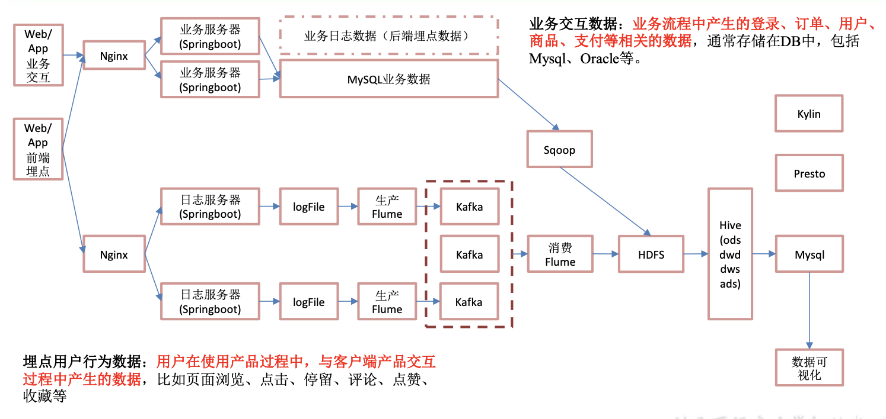

### 1. 采集行为数据概括

​	主要是用户在使用web端网页过程中,与客户端产品交互过程中产生的数据,比如页面浏览、点击、停留、评论、点赞、收藏等

### 1. 1 实时架构图



### 1.2 日志数据采集

> 这里提供了一个模拟生成数据的jar包,可以将日志发送给某一个指定的Kafka-Topic具体修改位置在jar 包中的application.yml文件中
>
> 可以通过修改application.yml文件,进行相关日志数据的更新发送

#####  1.2.1 application.yml文件

```
#  配置kafka 端口和topic
mock:
  kafka-server: "106.14.115.122:9092"
  kafka-topic: "ODS_BASE_LOG"
  #启动次数
mock.startup.count: 1000
  #设备最大值
mock.max.mid: 20
  #会员最大值
mock.max.uid: 50
  #商品最大值
mock.max.sku-id: 10
  #页面平均访问时间
mock.page.during-time-ms: 20000
  #错误概率 百分比
mock.error.rate: 3
  #每条日志发送延迟 ms
mock.log.sleep: 100
  #商品详情来源  用户查询，商品推广，智能推荐, 促销活动
mock.detail.source-type-rate: "40:25:15:20"

#领取购物券概率
mock.if_get_coupon_rate: 75

#购物券最大id
mock.max.coupon-id: 3

  #搜索关键词  
mock.search.keyword: "图书,小米,iphone11,电视,口红,ps5,苹果手机,小米盒子"
```

##### 1.2.2 执行jar文件

> 通过执行jar文件,将生成的日志数据发送到对应的Kafka主题中

```
jar_filepath=./gmall2020-mock-log-2020-12-18.jar
java -jar  -file $filepath
```

##### 1.2.3 Kafka实时消费日志数据

###### 1.2.3.1 数据格式

```
[{
 "common": {
  "ar": "440000",// (String) 区域
  "ba": "iPhone",// (String) 手机品牌
  "ch": "Appstore",// (String) 渠道号，应用从哪个渠道来的。
  "is_new": "1",// 是否新用户
  "md": "iPhone Xs Max",// (String) 手机型号
  "mid": "mid_10",// (String) 设备唯一标识
  "os": "iOS 13.3.1",// (String) 系统版本
  "uid": "9",//用户uid
  "vc": "v2.1.134"// (String) versionCode，程序版本号
 },
 "start": {
  "entry": "icon",//入口：  安装后进入=install，  点击图标= icon，  点击通知= notice
  "loading_time": 15167,//加载时长：计算下拉开始到接口返回数据的时间，（开始加载报0，加载成功或加载失败才上报时间）
  "open_ad_id": 1,//开屏广告Id
  "open_ad_ms": 6962,//开屏广告持续时间
  "open_ad_skip_ms": 0//开屏广告点击掉过的时间  未点击为0
 },
 "ts": 1617700440000
}, {
 "common": {
  "ar": "440000",
  "ba": "iPhone",
  "ch": "Appstore",
  "is_new": "1",
  "md": "iPhone Xs Max",
  "mid": "mid_10",
  "os": "iOS 13.3.1",
  "uid": "9",
  "vc": "v2.1.134"
 },
 "displays": [{
   //promotion-商品推广,recommend-算法推荐商品,query-查询结果商品,activity-促销活动
   "display_type": "activity",
   "item": "2",
   //sku_id-商品skuId,keyword-搜索关键词,sku_ids-多个商品skuId,activity_id-活动id-,coupon_id-购物券id
   "item_type": "activity_id",
   "order": 1,
   "pos_id": 2
  },
  {
   "display_type": "activity",
   "item": "2",
   "item_type": "activity_id",
   "order": 2,
   "pos_id": 2
  },
  {
   "display_type": "query",
   "item": "1",
   "item_type": "sku_id",
   "order": 3,
   "pos_id": 4
  }
 ],
 "page": {
  "during_time": 5816,//页面留存时间
  // home-首页, category-分类页, discovery-发现页, top_n-热门排行, favor-收藏页, 
  // search-搜索页, good_list-商品列表页, good_detail-商品详情, good_spec-商品规格, 
  // comment-评价, comment_done-评价完成, comment_list-评价列表, cart-购物车, 
  // trade-下单结算, payment-支付页面, payment_done-支付完成, orders_all-全部订单, 
  // orders_unpaid-订单待支付, orders_undelivered-订单待发货, 
  // orders_unreceipted-订单待收货, orders_wait_comment-订单待评价, 
  // mine-我的, activity-活动, login-登录, register-注册;
  "page_id": "home"
 },
 "ts": 1617700440000
}]
```


