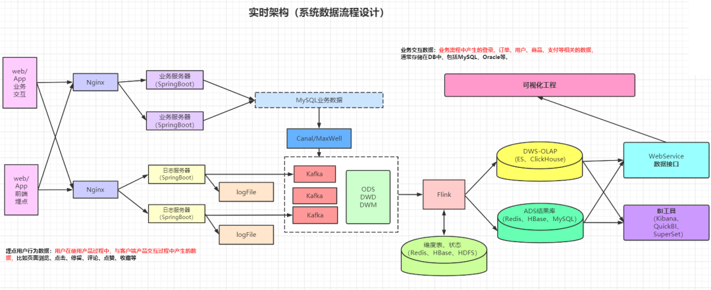

**`写在前面`**

随着数据科学的进步以及处理技术的成熟，业务/开发人员早已不在满足于传统的离线数仓报表或者提前设置好维度与指标的OLAP查询。近些年来，实时场景需求的不断增加，比如实时报表、实时指标、实时OLAP、实时监控等，一方面对实时数据提出了更多的要求，另一方面也促进了实时处理框架的发展，从storm、spark streaming、flink，flink作为目前最热门的实时处理框架，我们将从它开始慢慢揭露实时数仓的秘密。

该项目以尚硅谷大数据实时数仓项目为基础，结合电商互联网公司实时数据场景，对项目作了一定的扩展，从实时数仓理论基础开始，试着让读者理解实时数仓，并熟悉互联网领域常见的数据需求，学到有用的技术。时间回到2018年，作为转行入门大数据，当时的学习资源还没这么丰富，最开始在网上找视频看(在这里再次鸣谢尚硅谷)，然后和大部分群友一样，来到一线城市，海投简历...我也将把自己的经历分享给大家

**`项目技术栈`**

- 开发语言：Java、Scala、Sql
- 数据库：Mysql
- 数据采集：Canal
- 消息队列：Kafka
- 实时计算：Flink
- 实时OLAP：ClickHouse
- 数据存储：Phoenix、HBase、Redis
- 监控：Prometheus、Grafana
- 实时计算平台：基于Flink Sql、SpringBoot
- 实时数据服务：Spring、SpringBoot

如果你对以上某些技术栈并不熟悉，没有关系，我们将会一个一个深入学习。

**`一个通用的实时数仓架构`**

